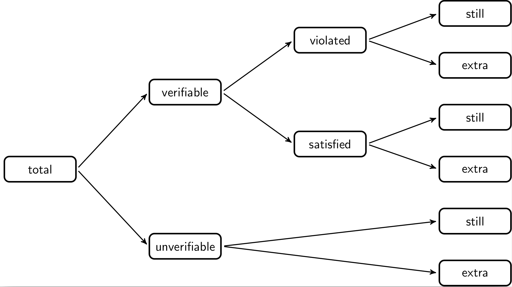

# Comparing data sets {#sect:comparing}


```{r, include=FALSE}
source("chunk_opts.R")
```

```{r, echo=FALSE}
library(validate)
```


When processing data step by step, it is useful to gather information on the
contribution of each step to the final result. This way the whole process can
be monitored and the contribution of each step can be evaluated. Schematically,
a data processing step can be visualised as follows.

{width=50%}

Here, some input data is processed by some procedure that is parameterized,
usually by domain experts. The output data is again input for a next step.


In the following two sections we discuss two methods to compare two or more
versions of a data set. In the last section we demonstrate how `validate` can
be combined with the
[lumberjack](https://cran.r-project.org/package=lumberjack) package to automate
monitoring in an R script.

## Cell counts

One of the simplest ways to compare different versions of a data set is to
count how many cells have changed. In this setting it can be useful to
distinguish between changes from available to missing data (and _vice versa_)
and changes between data where the values change. When comparing two
data sets, say the input and the output data, the total number of cells
can be decomposed according to the following schema.

{width=70%}

The total number of cells (fields) in the output data can be decomposed into
those cells that are filled (available) and those that are empty (missing).
The missing ones are decomposed into those that were already missing in the
input data and those that are still missing. Similarly, the available values
can be decomposed into those that were missing before and have been imputed.
And those that already were available can be decomposed in those that are the
same as before (unadapted) and those that ave been changed (adapted).


With the `validate` package, these numbers can be computed for two or more
datasets using `cells()`. As an example, we first create three versions of the
`SBS2000` dataset. The first version is just the unaltered data. In the 
second version we replace a revenue column with it's absolute value to 'repair'
cases with negative revenues. In the third version, we impute cases where
`turnover` is missing with the `vat` (value added tax) value, when available.

```{r}
library(validate)
data(SBS2000)
original <- SBS2000
version2 <- original
version2$other.rev <- abs(version2$other.rev)
version3 <- version2
version3$turnover[is.na(version3$turnover)] <- version3$vat[is.na(version3$turnover)]
```
We can now compare `version2` and `version3` to the original data set as follows.
```{r}
cells(input = original, cleaned = version2, imputed = version3)
```
The `cells` function accepts an arbitrary number of `name=data frame` arguments. The
names provided by the user are used as column names in the output. From the output we see
that the `cleaned` data set (`version2`) and in the `imputed` data set (`version3`) have
one adapted value compared to the original data. Similarly, no imputations took place in
preparing the `cleaned` data set, but a single value was imputed in the `imputed` dataset.

Since each data frame is compared to the first data frame, the last column can be considered
a 'cumulative' record of all changes that took place from beginning to end. It is also possible
to print differential changes, where each data set is compared with the previous one.
```{r}
cells(input = original, cleaned = version2, imputed = version3
    , compare="sequential")
```

The output of `cells()` is an array of class `cellComparison`. The most
interesting about this is that `validate` comes with two plot methods for such
objects. To demonstrate this, we will create  two more versions of the
`SBS2000` dataset.
```{r}
version4 <- version3
version4$turnover[is.na(version4$turnover)] <- median(version4$turnover, na.rm=TRUE)

# from kEUR to EUR
version5 <- version4
version5$staff.costs <- version5$staff.costs * 1000
```


```{r} 
out <- cells(input = original
           , cleaned = version2
           , vat_imp = version3
           , med_imp = version4
           , units   = version5)
par(mfrow=c(2,1))
barplot(out)
plot(out)
```

The bar plot and line plot convey the same information. The line plot is better
when the data sets are instances resulting from a sequential process. The bar
plot can be used more generally since it does not suggest a particular order.


## Comparing rule violations

When processing data it is interesting to compare how many data validations
are violated before and after a processing step. Comparing output data with 
input data, we can decompose the total number of validation results of
the output data as follows.

{width=70%}

The total number of validation results in the output data van be split into
those that are verifiable (`TRUE` or `FALSE`) and those that are unverifiable
(`NA`). The unverifiable cases can be split into those that were also
unverifiable in the input data (still) and those that were verifiable in the
input data but can now not be verified, because certain fields have been
emptied.  The verifiable cases can be split into those that yielded `FALSE`
(violated) and those that yielded `TRUE` (satisfied). Each can be split into
cases that stayed the same or changed with respect to the input data.

With `validate` the complete decomposition can be computed with `compare()`.
It takes as first argument a `validator` object and two or more data sets
to compare. We will use the data sets developed in the previous paragraph.

```{r}
rules <- validator(other.rev >= 0
                 , turnover >= 0
                 , turnover + other.rev == total.rev
)

comparison <- compare(rules
                    , input = original
                    , cleaned = version2
                    , vat_imp = version3
                    , med_imp = version4
                    , units   = version5)
comparison
```

By default each data set is compared to the first dataset (`input=original`).
Hence the last column represents the cumulative change of all processing steps
since the first data set. It is possible to investigate local differences by
setting `how='sequential'`. 

It is possible to plot the output for a graphical overview in two different
ways: a bar plot and a line plot.

```{r}
par(mfrow=c(2,1))
barplot(comparison)
plot(comparison)
```

## `validate` and `lumberjack`

The [lumberjack](https://cran.r-project.org/package=lumberjack) package makes
it easy to track changes in data in a user-defined way. The following example
is slightly adapted from the [JSS paper](https://arxiv.org/abs/2005.04050).

We create a script that reads data, performs a few data cleaning steps
and then writes the output. The script is stored in `clean_supermarkets.R` and
has the following code.

```{r, eval=FALSE}
## Contents of clean_supermarkets.R
library(validate)

# 1. simulate reading data
data(SBS2000)
spm <- SBS2000[c("id","staff","turnover","other.rev","total.rev")]

# 2. add a logger from 'validate'
start_log(spm, logger=lbj_cells())

# 3. assume empty values should be filled with 0
spm <- transform(spm, other.rev = ifelse(is.na(other.rev),0,other.rev))

# 4. assume that negative amounts have only a sign error
spm <- transform(spm, other.rev = abs(other.rev))

# 5a. ratio estimator for staff conditional on turnover
Rhat <- with(spm, mean(staff,na.rm=TRUE)/mean(turnover,na.rm=TRUE))

# 5b. impute 'staff' variable where possible using ratio estimator
spm <- transform(spm, staff = ifelse(is.na(staff), Rhat * turnover, staff))

# 6. write output
write.csv(spm, "supermarkets_treated.csv", row.names = FALSE)
```

In the first section we do not actually read data from a data source but take a
few columns from the SBS2000 data set that comes with the validate package.
The data to be processed is stored in a variable called `spm`.  Next, in
section two, we use the `lumberjack` function `start_log()` to attach a logging
object of type `lbj_cells()` to the data under scrutiny. Two things are of
note here:

1. The call to `library(validate)` is necessary to be able to use `lbj_cells()`.
   Alternatively you can use `validate::lbj_cells()`.
2. It is not necessary to load the `lumberjack` package in this script (although 
   it is no problem if you do).

In sections three and four, values for other revenue are imputed and then forced to 
be nonnegative. In section 5 a ratio model is used to impute missing staff numbers.
In section 7 the output is written. 

The purpose of the `lbh_cells()` logger is to record the output of `cells()`
after each step. To make sure this happens, run this file using `run_file()`
from the `lumberjack` package.

```{r}
library(lumberjack)
run_file('clean_supermarkets.R')
```
This command executed all code in `clean_supermarkets.R`, but `run_file()` also ensured
that all changes in the `spm` variable were recorded and logged using `lbj_cells()`.
The output is written to a `csv` file which we can read.
```{r}
logfile <- read.csv("spm_lbj_cells.csv")
```
The logfile variable has quite a lot of columns, so here show just two rows.
```{r}
logfile[3:4,]
```
Each row in the output lists the step number, a time stamp, the expression used
to alter the contents of the variable under scrutiny, and all columns computed
by `cells()`.  Since the logger always compares two consecutive steps, these
numbers are comparable to using `cells(comapare='sequential')`. For example, we
see that after step four, one value was adapted compared to the state after
step three. And in step three, 36 values were imputed compared to the state
created by step 2. In step four, no values were imputed.


It is also interesting to follow the progression of rule violations as the
`spm` dataset gets processed. This can be done with the `lbj_rules()` logger
that is exported by `validate`. Since `lumberjack` allows for multiple loggers
to be attached to an R object, we alter the first part of the above script as
follows, and store it in `clean_supermarkets2.R`

```{r, eval=FALSE}
## Contents of clean_supermarkets2.R
library(validate)

#1.a simulate reading data
data(SBS2000, package="validate")
spm <- SBS2000[c("id","staff","other.rev","turnover","total.rev")]

# 1.b Create rule set
rules <- validator(staff >= 0, other.rev>=0, turnover>=0
                 , other.rev + turnover == total.rev)


# 2. add two loggers 
start_log(spm, logger=lbj_cells())
start_log(spm, logger=lbj_rules(rules))

## The rest is the same as above ...
```

Running the file again using lumberjack, we now get two log files. 
```{r}
run_file("clean_supermarkets2.R")
```
Let's read the log file from `spm_lbj_rules.csv` and print row three and four.
```{r}
read.csv("spm_lbj_rules.csv")[3:4,]
```

We get the full output created by `validate::compare()`. For example we
see that after step three, 66 new cases satisfy one of the checks while two new
violations were introduced. The fourth step adds two new satisfied cases and no
new violations. The total number of violations after four steps equals five.

Until now the logging data was written to files that were determined automatically
by `lumberjack`. This is because `lumberjack` automatically dumps logging data
after processing executing the file when the user has not done so explicitly.
You can determine where to write the logging data by adding a `stop_log()`
statement anywhere in your code (but at the end would usually make most sense).

For example, add the following line of code at the end of
`clean_supermarkets2.R` to write the output of the `lbj_rules` logger to
`my_output.csv`.
```{r, eval=FALSE}
stop_log(spm, logger="lbj_rules",file="my_output.csv")
```

The format and way in which logging data is exported is fixed by the logger. So
`lbj_rules()` and `lbj_cells()` can only export to csv, and only the data we've
seen so far. The good news is that the `lumberjack` package itself contains
other loggers that may be of interest, and it is also possible to develop your
own logger. So it is possible to develop loggers that export data to a
database. See the [lumberjack paper](https://arxiv.org/abs/2005.04050) for a
short tutorial on how to write your own logger.


