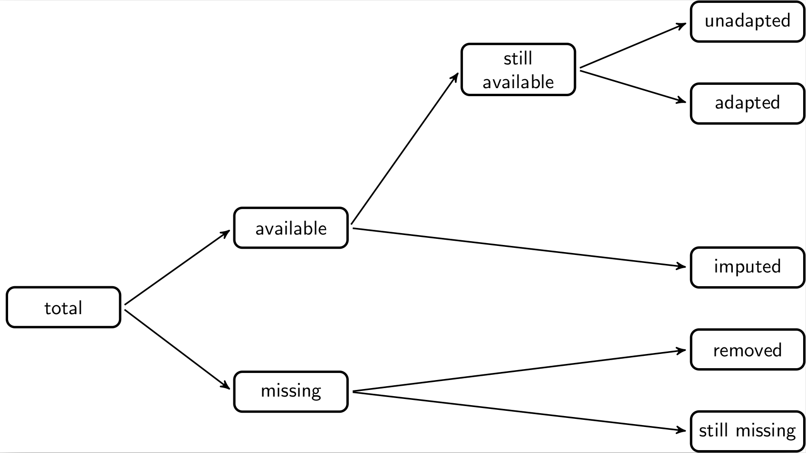

--- 
title: "The Data Validation Cookbook"
author: "Mark P.J. van der Loo"
date: "`r Sys.Date()`"
output: 
  bookdown::html_document2:
    theme: paper
    toc: true
    toc_depth: 3
    toc_float:
      collapsed: false
      smooth_scroll: false
    code_folding: none
    code_download: false
vignette: >
  %\VignetteIndexEntry{The Data Validation Cookbook}
  %\VignetteEngine{knitr::rmarkdown}
  \usepackage[utf8]{inputenc}
---


```{r, include=FALSE}
source("chunk_opts.R")
```


# Preface {-}

This book is about checking data with the
[validate](https://cran.r-project.org/package=validate) package for
[R](https://www.r-project.org). 

This version of the book was rendered with `validate` version 
`r packageVersion("validate")`.  The latest release of `validate` can be installed
from [CRAN](https://cran.r-project.org) as follows.
```{r, echo=TRUE, eval=FALSE}
install.packages("validate")
```

The purposes of this book include demonstrating the main tools and workflows of
the `validate` package, giving examples of common data validation tasks, and
showing how to analyze data validation results.

The book is organized as follows. Chapter \@ref(sect-intro) discusses the bare
necessities to be able to follow the rest of the book. Chapters
\@ref(sect-varlevelchecks) to \@ref(sect-statisticalchecks) form the 'cookbook'
part of the book and discuss many different ways to check your data by example.
Chapter \@ref(sect-indicators) is devoted to deriving plausibility measures
with the `validate` package.  Chapters \@ref(sect-work) and
\@ref(sect-rulefiles) treat working with validate in-depth. Chapter
\@ref(sect-comparing) discusses how to compare two or more versions of a
dataset, possibly automated through the
[lumberjack](https://cran.r-project.org/package=lumberjack) package.  The
section with Bibliographical Notes lists some references and points out some
literature for further reading.


## Prerequisites {-}

Readers of this book are expected to have some knowledge of R. In particular,
you should know how to import data into R and know a little about working with
data frames and vectors.

## Citing this work {-}

To cite the `validate` package please use the following citation.

> MPJ van der Loo and E de Jonge (2021). Data Validation Infrastructure for
> R. _Journal of Statistical Software_, 97(10) [paper](https://www.jstatsoft.org/article/view/v097i10).


To cite this cookbook, please use the following citation.

> MPJ van der Loo (`r substr(as.Date(Sys.time()),1,4)`) _The Data Validation Cookbook_
> version `r packageVersion("validate")`. [https://data-cleaning.github.io/validate](http://data-cleaning.github.io/validate/)


## Acknowledgements {-}

This work was partially funded by European Grant Agreement 88287--NL-VALIDATION
of the European Statistical System.


## Contributing {-}

If you find a mistake, or have some suggestions, please file an issue or a pull
request on the GitHub page of the package:
[https://github.com/data-cleaning/validate](https://github.com/data-cleaning/validate).
If you do not have or want a GitHub account, you can contact the author via the
e-mail address that is listed with the package.


## License {-}

```{r, echo=FALSE, include=!knitr::is_latex_output()}
#knitr::asis_output("
#[](https://creativecommons.org/licenses/by/4.0/)
#")
```

This work is licensed under [Creative Commons Attribution BY-NC 4.0 International License](https://creativecommons.org/licenses/by-nc/4.0/).


# Introduction to validate {#sect-intro}

```{r, include=FALSE}
source("chunk_opts.R")
```


> Data Validation is an activity verifying whether or not a combination of
> values is a member of a set of acceptable combinations [(Di Zio et al , 2015)](https://www.markvanderloo.eu/files/share/zio2015methodology.pdf)

The validate package is intended to make checking your data easy, maintainable, and reproducible.
It does this by allowing you to

- test data against a reusable set of data validation rules:
- investigate, summarise, and visualise data validation results;
- import and export rule sets from and to various formats;
- filter, select and otherwise manipulate data validation rules';
- investigate, summarise, and visualise rule sets.

For advanced rule manipulation there is the
[validatetools](https://cran.r-project.org/package=validatetools) package.


```{r, include=FALSE, eval=knitr::is_latex_output()}
knitr::opts_chunk$set(comment=NA)
```

## A quick example

Here's an example demonstrating the typical workflow. We'll use the built-in
`cars` data set, which contains 50 cases of speed and stopping distances of
cars. 
```{r }
data(cars)
head(cars, 3)
```
Validating data is all about checking whether a data set meets presumptions or
expectations you have about it, and the validate package makes it easy for you
to define those expectations. Let's do a quick check on variables in the
`cars` data set. We first load the package, and create a list
of data quality demands with the `validator()` function.
```{r}
library(validate)
rules <- validator(speed >= 0
                 , dist >= 0
                 , speed/dist <= 1.5
                 , cor(speed, dist)>=0.2)
```
Here, the first three rules are record-wise checks: each record will yield one
answer. In the last rule we check whether speed and distance are positively
correlated this will yield a single `TRUE` or `FALSE` for the whole data set.
We now confront the data with those rules and save the output into a variable
called `out`.
```{r}
out   <- confront(cars, rules)
```
The easiest way to check the results is with `summary()`. 
```{r}
summary(out)
```
This returns a data frame with one line of information for each rule `V1`,
`V2`, `V3` and `V4`. To be precise:

- How many data items were checked against each rule.
- How many items passed, failed or resulted in `NA`.
- Whether the check resulted in an error (could not be performed) or gave an warning.
- The expression that was actually evaluated to perform the check.

The same information can be summarized graphically as follows
`r if( knitr::is_latex_output()) knitr::asis_output("(see Figure \\ref{fig:validateplot})")`. 
```{r,fig.height=7, fig.width=7, echo=!knitr::is_latex_output(), eval=!knitr::is_latex_output()}
plot(out)
```
```{r, label="validateplot", fig.height=5, fig.width=5, out.width="0.7\\textwidth", fig.align="center", echo=knitr::is_latex_output(), eval=knitr::is_latex_output(), fig.env="figure",fig.pos="!t", fig.cap="Plot of validation output."}
plot(out)
```

In this plot each horizontal bar indicates the percentage of Failing, Passing,
and Missing cases. The table in the legend lists the total number of Fails,
Passes and Missings, summed over all checks. Here, we have 4 rules. The first
three rules yield 50 results each, while the last rule yields a single result.
Hence there are 151 validation results in total.


Using the function `violating` we can select the records that violate one or
more rules. We select only the first three results because the last rule can
not be interpreted record by record.
```{r}
violating(cars, out[1:3])
```

We can extract all individual results using for example `as.data.frame`.
```{r}
df_out <- as.data.frame(out)
head(df_out, 3)
```
We see that in record `1`, rule `V1`, was satisfied (the result is `TRUE`), and
that validate left a bit of slack when executing the rule, to avoid false
negatives caused by machine rounding issues.


Summarizing, the basic workflow in `validate` is to create a rule set, confront
a data set with the rules in the rule set, and then analyze or use the results
further. To understand which checks you can perform with `validate` you only
need to remember the following.

> Any R expression that results in a `logical` is accepted by `validate` as a
> validation rule.


You are now ready to start validating your data, and navigate Chapters
\@ref(sect-availableunique)-\@ref(sect-statisticalchecks) to learn how to
define specific types of checks. Chapter~\@ref(sect-work), discusses more
details about working with `validate`.


# Variable checks {#sect-varlevelchecks}

```{r, include=FALSE}
source("chunk_opts.R")
```


Variable checks are checks that can be performed on a field-by-field basis. An
example is checking that a variable called `Age` is nonnegative, or of integer
type. Variable checks are among the simplest checks.


**Data**

In this section we will use the `SBS2000` dataset, that is included with `validate`.

```{r}
library(validate)
data(SBS2000)
head(SBS2000, 3)
```

See `?SBS2000` for a description.


## Variable type

In `R`, one can test the type of a variable using built-in functions such as
`is.numeric` or `is.character`. 
```{r}
is.character("hihi")
is.character(3)
```

In `validate`, any function starting with `is.` ('is' followed by a dot) is
considered a validation function. 

```{r}
rules <- validator(
    is.character(size)
  , is.numeric(turnover)
)
out <- confront(SBS2000, rules)
summary(out)
```
We see that each rule checks a single item, namely one column of data. The
first rule is violated (it is in fact a `factor` variable). The second rule
is satisfied.

## Missingness {#sect-missingness}

Use R's standard `is.na()` to check missing items in individual variables. Negate
it to check that values are available.

```{r}
rule <- validator(
   !is.na(turnover)
 , !is.na(other.rev)
 , !is.na(profit)
)
out <- confront(SBS2000, rule)
summary(out)
```

We see that in `r summary(out)$fails[1]` cases the variable `turnover` is missing,
while `other.rev` and `profit` are missing respectively in `r summary(out)$fails[2]`
and `r summary(out)$fails[3]` occasions.

To demand that all items must be present or absent for a certain variable,
use R's  quantifiers: `any()` or `all()`, possibly negated.
```{r}
rules <- validator( 
    !any(is.na(incl.prob))
    , all(is.na(vat)) )
out <- confront(SBS2000, rules)
summary(out) 
```


- To check whether records or parts thereof are completed, see \@ref(sect-iscomplete).
- To check whether records are available at all, see \@ref(sect-completeness).


## Field length

The number of characters in text fields can be tested using either R's standard
`nchar()` function, or with the convenience function `field_length`.

```{r}
rules <- validator(
   nchar(as.character(size)) >= 2
 , field_length(id, n=5)
 , field_length(size, min=2, max=3)
)
out <- confront(SBS2000, rules)
summary(out)
```
One advantage of `check_field_length` is that its argument is converted to
character (recall that `size` is a `factor` variable). The function
`field_length` can be used to either test for exact field lengths or to
check whether the number of characters is within a certain range.

The field length is measured as the number of [code
points](https://en.wikipedia.org/wiki/Code_point). Use `type="width"` to
measure the printed width (nr of columns) or `type="bytes"` to count the number
of bytes. 


## Format of numeric fields

For numbers that are stored in `character` type, there is a convenience
function called `number_format()` that accepts a variable name
and a format specification.

```{r}
dat <- data.frame(x = c("2.54","2.66","8.142","23.53"))
```
To check that the numbers are formatted with one figure before, and two figures
after the decimal point, we perform the following check.
```{r}
rule <- validator( number_format(x, format="d.dd"))
values(confront(dat, rule))
```
Here, the specification `format="d.dd"` describes the allowed numeric formats.
In this specification the `"d"` stands for a digit, any other character except
the asterisk (`*`) stands for itself. The asterisk is interpreted as 'zero or
more digits'. Here are some examples of how to define number formats.

|format       | match                         | non-match                           |
|-------------|-------------------------------|-------------------------------------|
|`0.dddd`     | `"0.4321"`                    | `"0.123"`,`"1.4563"`                |
|`d.ddEdd`    | `"3.14E00"`                   | `"31.14E00"`                        |
|`d.*Edd`     | `"0.314E01"`,`"3.1415297E00"` | `"3.1415230"`                       |
|`d.dd*`      | `"1.23"`, `"1.234"`,$\ldots$  | `"1.2"`                             |

The last example shows how to check for a minimal number of digits behind the decimal
point.


There are special arguments to check the number of decimal figures 
after the decimal separator. 
```{r}
x <- c("12.123","123.12345")
number_format(x, min_dig=4)
number_format(x, max_dig=3)
number_format(x, min_dig=2, max_dig=4)
number_format(x, min_dig=2, max_dig=10)
# specify the decimal separator.
number_format("12,123", min_dig=2, dec=",")
```
The arguments `min_dig`, `max_dig` and `dec` are ignored when `format` is
specified.

This function is convenient only for fairly simple number formats. Generic
pattern matching in strings is discussed in the next section.


## General field format

A simple way to check for more general format is to use [globbing
patterns](https://en.wikipedia.org/wiki/Glob_(programming)). In such patterns,
the asterisk wildcard character (`*`) is interpreted as 'zero or more
characters' and the question mark (`?`) is interpreted as 'any character'.

For example, to check that the `id` variable in `SBS2000` starts with `"RET"`,
and that the `size` variable has consists of `"sc"` followed by precisely one
character, we can do the following.
```{r}
rule <- validator(field_format(id, "RET*")
                , field_format(size, "sc?" ))
out  <- confront(SBS2000, rule)
summary(out)
```
Here, the globbing pattern `"RET*"` is understood as 'a string starting with
`"RET"`, followed by zero or more characters. The pattern `"sc?"` means 'a
string starting with `"sc"`, followed by a single character.


The most general way to check whether a field conforms to a pattern is to use a
[regular expression](https://en.wikipedia.org/wiki/Regular_expression). The
treatment of regular expressions is out of scope for this book, but we will
give a few examples. A good introduction to regular expressions is given by

> J. Friedl (2006) _Mastering regular expressions._ O'Reilly Media.


In `validate` one can use `grepl` or `field_format`, with the argument `type="regex"`

```{r}
rule <- validator(
          grepl("^sc[0-9]$", size)
        , field_format(id, "^RET\\d{2}$" , type="regex") )
summary(confront(SBS2000, rule))
```

Here, the expression `"^sc[0-9]$"` is a regular expression that should be read
as: the string starts (`"^"`) with `"sc"`, is followed by a number between 0
and 9 (`"[0-9]"`) and then ends (`"$"`). The regular expression `"^RET\\{d}2"`
indicates that a string must start (`"^"`) with `"RET"`, followed by two
digits (`"\\d{2}"`), after which the string must end (`"$"`).


Globbing patterns are easier to develop and easier to understand  than regular
expressions, while regular expressions offer far more flexibility but are
harder to read. Complex and long regular expressions may have subtle matching
behaviour that is not immediately obvious to inexperienced users. It is
therefore advisable to test regular expressions with a small dataset
representing realistic cases that contains both matches and non-matches. As a
rule of thumb we would advise to use globbing patterns unless those offer
insufficient flexibility.


## Numeric ranges

Numerical variables may have natural limits from below and/or
above. For one-sided ranges, you can use the standard comparison operators.

```{r}
rules <- validator(TO = turnover >= 0
                 , TC = total.costs >= 0)
```

If a variable is bounded both from above and below one can use two rules,
or use the convenience function `in_range`.

```{r}
rules <- rules + 
  validator(PR = in_range(incl.prob, min=0, max=1))
```
By default, `in_range` includes the boundaries of the range, so the above rule
is equivalent to `incl.prob >= 0` and `incl.prob <= 1`. 

```{r}
out <- confront(SBS2000, rules, lin.ineq.eps=0)
```
Here we set `lin.ineq.eps=0` to keep `validate` from building in a 
margin for machine rounding errors.

```{r}
summary(out)
```

For numeric ranges it is often a better idea to work with inclusive
inequalities ($\leq$, $\geq$) than with strict inequalities ($<$, $>$).  Take
as an example the strict inequality demand `income > 0`. This means that _any_
income larger than zero is acceptable, including numbers such as $0.01$,
$0.000001$ and $10^{-\textrm{Googol}}$. In practice there is almost always a
natural minimal acceptable value that is usually dictated by the unit of
measurement. For example, if we measure income in whole Euros, a better demand
would be `income >= 1`.


## Ranges for times and periods

For objects of class `Date` and objects of class `POSIXct` one can use comparison
operators and `in_range` in the same way as for numerical data. The `in_range` function
has a convenience feature for period data that is coded in character data, as in 
`"2018Q1"` for quarterly data. 

We first generate some example data.
```{r}
period = sprintf("2018Q%d", 1:4)
period
```

The `in_range` function is capable of recognizing certain date or period
formats.
```{r}
in_range(period, min="2017Q2", max = "2018Q2")
```
It is possible to specify your own date-time format using `strftime` notation.
See `?in_range` and `?strptime` for specifications.


## Code lists

A code list is a set of values that a variable is allowed to assume. For small
code lists, one can use the `%in%` operator.

```{r}
rule <- validator(size %in% c("sc0","sc1","sc2","sc3"))
out  <- confront(SBS2000, rule)
summary(out)
```
Notice that `validate` replaces `%in%` with `%vin%`. The reason is that `%vin%` has more consistent
behavior in the case of missing data. In particular,
```{r}
c(1, 3, NA) %in% c(1,2)
c(1, 3, NA) %vin% c(1,2)
```

For longer code lists it is convenient to refer to an externally provided list.
There are two ways of doing this: reading the list in the right-hand-size of `%in%`,
or passing a code list to `confront` as reference data.

Suppose we have a file called `codelist.csv` with a column `code`. We can define
a rule as follows.

```{r}
rule <- validator(
  x %in% read.csv("codelist.csv")$code
)
## Or, equivalently
rule <- validator(
  valid_codes := read.csv("codelist.csv")$code
  , x %in% valid_codes
)

```
The disadvantage is that the rule now depends on a path that may or may not be
available at runtime.

The second option is to assume that a variable, say `valid_codes` exists at
runtime, and pass this with `confront`.
```{r}
codelist <- c("sc0","sc1","sc2","sc3")
rule <- validator(size %in% valid_codes)
# pass the codelist
out <- confront(SBS2000, rule
              , ref=list(valid_codes=codelist))
summary(out)
```
This way, (very) large code lists can be used, but note that it does
require a 'contract' between variable names used in the rule set
and variables passed as reference data.


# Availability and uniqueness {#sect-availableunique}


```{r, include=FALSE}
source("chunk_opts.R")
```

In this Chapter it is demonstrated how to check whether records are available
and/or complete with respect to a set of keys, and whether they are unique.
The checks described here are typically useful for data in 'long' format, where
one column holds a value and all the other columns identify the value.

- To test for missing values in individual variables, see also \@ref(sect-missingness).
- To check whether records or parts thereof are completed, see \@ref(sect-iscomplete).

**Data**

In this Chapter the `samplonomy` dataset is used that comes with the `validate`
package.

```{r}
library(validate)
data(samplonomy)
head(samplonomy, 3)
```

## Long data

The samplonomy data set is structured in 'long form'. This means that each
record has a single `value` column, and one or more columns containing
character values that together describe what the value means.

```{r}
head(samplonomy,3)
```
The data set contains several time series for multiple measures
of the fictional country 'Samplonia'. There are time series for several
subregions of Samplonia.

Long format data is typically used as a transport format: it may be used to
bulk-load data into SQL-based data base systems, or to transfer data between
organisations in a unambiguous way.

Data in long form is in general much harder to check and process for
statistical purpose than data in wide format, where each variable is stored in
a separate column. The reason is that in long format relations between
different variables are spread out across records, and those records are not
necessarily ordered in any particular way prior to processing.  This makes
interpretation of validation fails intrinsically harder for long-form data than
for wide-form data.

The `samplonomy` data set has a particularly nasty structure. It contains both
annual and quarterly time series for GDP, Import, Export and the Balance of
Trade (export less import). The period column therefore contains both quarterly
and annual labels. Furthermore, there are time series for the whole of
Samplonia (region Samplonia), for each of its two provinces (regions Agria and
Induston) and for each of its districts within Agria (Wheaton and Greenham) and
Induston (Smokely, Mudwater, Newbay and Oakdale). 

Naturally, we expect that the key combinations are unique, that all time series
are gapless and complete, that the Balance of trade equals Export less Import
everywhere, that district values add up to the provinces', and that province
values add up to the total of Samplonia. Finally, the quarterly time series
must add up to the annual values. 


## Uniqueness  {#sect-uniqueness}

The function `is_unique()` checks whether combinations of variables (usually
key variables) uniquely identify a record. It accepts any positive number of
variable names and returns `FALSE` for each record that is duplicated with
respect to the designated variables.


Here, we test whether region, period, and measure uniquely identify a value in
the `samplonomy` data set.
```{r}
rule <- validator(is_unique(region, period, measure))
out <- confront(samplonomy, rule)
# showing 7 columns of output for readability
summary(out)[1:7]
```
There are `r summary(out)$fails` fails. After extracting the individual 
values for each record we can find the duplicated ones using a
convenience function from `validate`.

```{r}
violating(samplonomy, out)
```

There are a two subtleties to keep in mind when interpreting uniqueness. The
first has to do with missing values, and the second has to do with grouping.
To start with the missing value problem, take a look at the following two-record
data frame.
```{r}
df <- data.frame(x = c(1,1), y = c("A",NA))
df
```
How should we judge whether these two records are unique?  A tempting option is
to say the first record is unique, and to return `NA` for the second record
since it contains a missing value: R has the habit of returning `NA` from
calculations when an input value is `NA`. This choice is not invalid, but it
would have consequences for determining whether the first record is unique as
well. After all, it is possible to fill in a value in the missing field such
that the two records are duplicates. Therefore, if one would return `NA` for
the second record, the correct thing to do is to also return `NA` for the first
record. In R, the choice is made to treat `NA` as an actual value when checking
for duplicates or unique records (see `?duplicated` from base R). To see this
inspect the following code and output.
```{r}
df <- data.frame(x=rep(1,3), y = c("A", NA, NA))
is_unique(df$x, df$y)
```

The second subtlety has to do with grouping. You may want to test whether a
column is unique, given one or more other variables. It is tempting to think
that this requires a split-apply-combine approach where the dataset is first
split according to one or more grouping variables, check for uniqueness of the
column in each group, and then combine the results. However, such an approach
is not necessary as you can simply add the grouping variables to the list of
variables that _together_ must be unique.

As an example, consider the output of the following two approaches.
```{r}
# y is unique, given x. But not by itself
df <- data.frame(x=rep(letters[1:2],each=3), y=rep(1:3,2))

# the split-apply-combine approach
unsplit(tapply(df$y, df$x, is_unique), df$x)

# the combined approach
is_unique(df$x, df$y)
```


## Availability of records {#sect-completeness}

This section is on testing for availability of whole records. Testing for individual
missing values (`r NA`), is treated in \@ref(sect-missingness). 


We wish to ensure that for each region, and each variable, the periods 2014,
2015, $\ldots$, 2019 are present.  Using `contains_at_least` we can establish
this.

```{r}
rule <- validator(
  contains_at_least( 
      keys = data.frame(period = as.character(2014:2019))
    , by=list(region, measure) )
)
out <- confront(samplonomy, rule)
# showing 7 columns of output for readability
summary(out)[1:7]
```
The function `contains_at_least` splits the `samplonomy` dataset into blocks
according to values of `region` and `measure`. Next, it checks that in each
block the variable `period` contains at least the values 2014--2019.

The return value is a logical vector where the number of elements equals the
number of rows in the dataset under scrutiny. It is `TRUE` for each block
where all years are present, and `FALSE` for each block where one or more of the
years is missing. In this case 29 records are labeled as FALSE. These
can be found as follows.

```{r}
head(violating(samplonomy, out))
```
Inspection of these records shows that in this block, for `Agria` the GDP
for `"2015"` is missing.


We can perform a stricter check, and test whether for each `measure`, all
quarters `"2014Q1"` $\ldots$ `"2019Q4"` are present for each province (`Agria`
and `Induston`). First create a key set to test against. 
```{r}
years <- as.character(2014:2019)
quarters <- paste0("Q",1:4)

keyset <- expand.grid(
  region = c("Agria", "Induston")
  , period = sapply(years, paste0, quarters))

head(keyset)
```
This key set will be referenced in the rule, and passed to `confront` as reference
data.

```{r}
rule <- validator(
          contains_at_least(keys=minimal_keys, by=measure) 
        )
out <- confront(samplonomy, rule
              , ref=list(minimal_keys=keyset))
# showing 7 columns of output for readability
summary(out)[1:7]
```
There are `r summary(out)$fails` fails. Inspecting the data set as above, we
see that for Induston, the `export` is missing in `"2018Q3"`.


Finally, we do a strict test, to check that for each `measure` all periods and
all regions are reported. We also demand that there are no more and no less
records than for each individual measure. For this, the function
`contains_exactly` can be used.

First create a keyset.

```{r}
years <- as.character(2014:2019)
quarters <- paste0("Q",1:4)

keyset <- expand.grid(
  region  = c(
    "Agria" 
   ,"Crowdon"
   ,"Greenham"
   ,"Induston"
   ,"Mudwater"
   ,"Newbay"
   ,"Oakdale"
   ,"Samplonia"
   ,"Smokely"
   ,"Wheaton"
  )
 ,period = c(years, sapply(years, paste0, quarters))
)
head(keyset)
```
The keyset is passed as reference data to the rule using `confront`.
```{r}
rule <- validator(contains_exactly(all_keys, by=measure))
out  <- confront(samplonomy, rule
               , ref=list(all_keys=keyset))
# showing 7 columns of output for readability
summary(out)[1:7]
```

To find where the errors reside, we first select the records with an error and
then find the unique measures that occur in those records.
```{r}
erroneous_records <- violating(samplonomy, out)
unique(erroneous_records$measure)
```
So here, blocks containing GDP and Export have entire records missing.


## Gaps in (time) series

For time series, or possibly other series it is desirable that
there is a constant distance between each two elements of the series.
The mathematical term for such a series is called a _linear sequence_.
Here are some examples of linear series.

- The natural numbers: $1,2,3,\ldots$
- The even natural numbers $2, 4, 6, \ldots$
- Quarters periods: `"2020Q1"`, `"2020Q2"`, $\ldots$
- Years (these are just natural numbers): $2019, 2020, \ldots$

The `validate` functions `is_linear_sequence` and `in_linear_sequence` check
whether a variable represents a linear series, possibly in blocks defined by
categorical variables. They can be used interactively or as a rule in a
validator object. We first demonstrate how these functions work, and then give
an example with the `samplonomy` dataset.

```{r}
is_linear_sequence(c(1,2,3,4))
is_linear_sequence(c(8,6,4,2))
is_linear_sequence(c(2,4,8,16))
```
For character data, the function is capable of recognizing certain formats
for time periods.
```{r}
is_linear_sequence(c("2020Q1","2020Q2","2020Q3","2020Q4"))
```
See `?is_linear_sequence` for a full specification of supported
date-time formats.

It is not necessary for data to be sorted in order to be recognized as a
linear sequence.
```{r}
is_linear_sequence(c("2020Q4","2020Q2","2020Q3","2020Q1"))
```
One can force a begin and/or end point for the sequence as well.
```{r}
is_linear_sequence(c("2020Q4","2020Q2","2020Q3","2020Q1")
                 , begin = "2020Q2")
```
Finally it is possible to split a variable by one or more other columns and
check whether each block represents a linear sequence.

```{r}
series <- c(1,2,3,4,1,2,3,3)
blocks <- rep(c("a","b"), each = 4)
is_linear_sequence(series, by = blocks)
```
Now, this result is not very useful since now it is unknown which block 
is not a linear series. This is where the function `in_linear_sequence` comes in.
```{r}
in_linear_sequence(series, by = blocks)
```
There are some subtleties. A single element is also a linear sequence (of length 1).
```{r}
is_linear_sequence(5)
```
This can yield surprises in cases of blocks of length 1.
```{r}
blocks[8] <- "c"
data.frame(series = series, blocks = blocks)
in_linear_sequence(series, blocks)
```
We now have three linear series, namely

- For `"a"`: `1,2,3,4`
- For `"b"`: `1,2,3`
- For `"c"`: `3`.

We can circumvent this by giving explicit bounds.
```{r}
in_linear_sequence(series, blocks, begin = 1, end = 4)
```


We now return to the `samplonomy` dataset.  We wish to check that for
each measure and each area, the time series are linear series. Since there
are time series of different frequencies, we need to split the data by frequency
as well.

```{r}
rule <- validator(
          in_linear_sequence(period
            , by = list(region, freq, measure))
        )
out  <- confront(samplonomy, rule)
summary(out)[1:7]
```
We can find the blocks where records are not in sequence as follows (output not
printed here for brevity).

```{r, results='hide'}
violating(samplonomy, out)
```
Inspection of the selected records shows that for Agria the GDP for 2015 is
missing, and that for Induston the Export for 2018Q3 is missing while Export
for 2018Q2  occurs twice (but with different values)


# Multivariate checks


```{r, include=FALSE}
source("chunk_opts.R")
```

In this Chapter we treat tests that involve relationships between variables.


**Data**

In this Chapter we will use the `SBS2000` dataset that comes with `validate`.

```{r}
library(validate)
data(SBS2000)
head(SBS2000, 3)

```

## Completeness of records {#sect-iscomplete}

The functions `is_complete()` and `all_complete()` are convenience functions
that test for missing values or combinations thereof in records.

```{r}
rules <- validator(
          is_complete(id)
        , is_complete(id, turnover)
        , is_complete(id, turnover, profit )
        , all_complete(id)
)
out <- confront(SBS2000, rules)
# suppress last column for brevity
summary(out)[1:7]
```
Here, the first rule checks for missing data in the `id` variable, the second
rule checks whether subrecords with `id` and `turnover` are complete, and the
third rule checks whether subrecords with `id`, `turnover` and `profit` are
complete.  The output is one logical value (`TRUE` or `FALSE`) for each record.

The fourth rule tests whether _all_ values are present in the `id` column, and
it results in a single `TRUE` or `FALSE`. 

- To test for missing values in individual variables, see also \@ref(sect-missingness).
- To check whether records are available at all, see \@ref(sect-completeness).


## Balance equalities and inequalities 

Balance restrictions occur for example in economic microdata, where financial
balances must be met.
```{r}
rules <- validator(
    total.rev - profit == total.costs
  , turnover + other.rev == total.rev
  , profit <= 0.6*total.rev
)

out <- confront(SBS2000, rules)
summary(out)
```
Here, the first rule checks a balance between income, costs, and profit; the
second rule checks a sub-balance, and the third rule is a plausibility check
where we do not expect profit to exceed 60 per cent of the total revenue.

Observe that the expressions have been altered by `validate` to account for
possible machine rounding differences. Rather than testing whether variable $x$
equals variable $y$, `validate` will check $|x-y|\leq \epsilon$, where the
default value of $\epsilon$ is $10^{-8}$. The value of this tolerance can be
controlled for linear equalities and inequalities using respectively
`lin.eq.eps` and `lin.ineq.eps`.

```{r}
out <- confront(SBS2000, rules, lin.ineq.eps=0, lin.eq.eps=0.01)
summary(out)
```

See \@ref(sect-options) for more information on setting and resetting options.


## Conditional restrictions

Conditional restrictions are all about demanding certain value combinations.
In the following example we check that a business with staff also has staff
costs.
```{r}
rule <- validator(if (staff >= 1) staff.costs >= 1)
out  <- confront(SBS2000, rule)
summary(out)
```
Here, combinations where there is a positive number of staff must be
accompanied with a positive staff cost. 

Validate translates the rule `if ( P ) Q` to an expression of the form `!P |
Q`. The reason for this is that the latter can be evaluated faster
(vectorised).

The results are to be interpreted as follows. For each record, `validate`  will
check that cases where `staff>=1` are accompanied by `staff.costs >= 1`. In
cases where this test results in `FALSE` this means that either the staff
number is too high, or the staff costs are too low. To be precise, the results
of a conditional restriction match those of an implication in first-order
logic as shown in the truth table below.

$$
\begin{array}{ll|c}
P & Q & P\Rightarrow Q\\
\hline
T & T & T\\
T & F & F\\
F & T & T\\
F & F & F\\
\end{array}
$$


## Forbidden value combinations

In some cases it is more convenient to have a list of forbidden (key) value
combinations than specifying such combinations individually.  The function
`does_not_contain()` supports such situations.


As an example, let's first create some transaction data.
```{r}
transactions <- data.frame(
   sender   = c("S21", "X34", "S45","Z22")
 , receiver = c("FG0", "FG2", "DF1","KK2")
 , value    = sample(70:100,4)
)
```
We assume that it is not possible for senders with codes starting with an `"S"`
to send something to receivers starting with `FG`. A convenient way to encode
such demands is to use 
[globbing patterns](https://en.wikipedia.org/wiki/Glob_(programming)).
We create a data frame that lists forbidden combinations (here: one combination
of two key patterns).

```{r}
forbidden <- data.frame(sender="S*",receiver = "FG*")
```
Note that the column names of this data frame correspond to the columns in the transactions
data frame. We are now ready to check our transactions data frame.
```{r}
rule <- validator(does_not_contain(glob(forbidden_keys)))
out <- confront(transactions, rule, ref=list(forbidden_keys=forbidden))
## Suppress columns for brevity
summary(out)[1:7]
```
Observe that we use `glob(forbidden_keys)` to tell `does_not_contain` that the
key combinations in the `forbidden_keys` must be interpreted as globbing
patterns.

The records containing forbidden keys can be selected as follows.
```{r}
violating(transactions, out)
```

It is also possible to use regular expression patterns, by labeling the
forbidden key set with `rx()`. If no labeling is used, the key sets are
interpreted as string literals.


# Statistical checks {#sect-statisticalchecks}

 
```{r, include=FALSE}
source("chunk_opts.R")
```

Statistical checks involve group properties such as the means of columns. These
characteristics can be checked for whole columns or grouped by one or more
categorical variables. It is also possible to use group-wise computed
statistics in validation rules.  For example if you want to compare individual
values with a mean within a group.

For long-form data it is possible to compare aggregate values with underlying
details. For example to test whether quarterly time series add up to annual
totals. It is also possible to check properties of groups, for example whether
in every household (a group of persons) there is exactly one head of household.

**Data**

In this Chapter we will use the `SBS2000` dataset that comes with `validate`.

```{r}
library(validate)
data(SBS2000)
head(SBS2000, 3)
```

We shall also use the `samplonomy` dataset that also comes with `validate`. See also
\@ref(long-data).

```{r}
data(samplonomy)
head(samplonomy, 3)
```


## Statistical and groupwise characteristics {#sect-groupwise}

Any R expression that ultimately is an equality or inequality check is
interpreted as a validation rule by validate. This means that any statistical
calculation can be input to a rule.

Here we check the mean profit and correlation coefficient between profit and
turnover.
```{r}
rule <- validator(
    mean(profit, na.rm=TRUE) >= 1
  , cor(turnover, staff, use="pairwise.complete.obs") > 0
)
out <- confront(SBS2000, rule)
# suppress some columns for brevity
summary(out)[1:7]
```

There are a few helper functions to compute group-wise statistics, and to make
comparing values with group aggregates possible.

For example, here we check whether each turnover is less than ten times
the group-wise median.
```{r}
rule <- validator(
  turnover <= 10*do_by(turnover, by=size, fun=median, na.rm=TRUE)
)
out <- confront(SBS2000, rule)
# suppress some columns for brevity
summary(out)[1:7]
```
Here, in the right-hand side of the rule the group-wise median of turnover is
computed. The function `do_by` is very similar to functions such as `tapply`
in base R. The difference is that `do_by` works on vectors only (not on data
frames) and always repeats the values of `fun` so that the length of the output is
equal to the length of the input.
```{r}
medians <- with(SBS2000, do_by(turnover, by=size, fun=median, na.rm=TRUE))
head(data.frame(size = SBS2000$size, median=medians))
```
There are also some convenience functions, including `sum_by`, `mean_by`, `min_by`, and `max_by`.

## Group properties

In this section, we group data by one or more categorical variables and
check for each group whether a rule is satisfied. In particular we are
going to check whether each household in a small dataset has a unique 
'head of household'.

We first create some data with household id (`hhid`) a person id (`person`) and
that person's role in the household (`hhrole`).
```{r}
d <- data.frame(
   hhid   = c(1,  1,  2,  1,  2,  2,  3 )
 , person = c(1,  2,  3,  4,  5,  6,  7 )
 , hhrole = c("h","h","m","m","h","m","m")
)
d
```
With `exists_one()` we can check that there is exactly one person
with the role `"h"` (head) in each household, by grouping on household id.
```{r}
rule <- validator(exists_one(hhrole == "h", by=hhid))
out <- confront(d, rule)
# suppress some columns for brevity
summary(out)
```
We can inspect the results by selecting the violating record groups.
```{r}
violating(d, out)
```
We see that household 1 has two heads of household, while household 3 has no head 
of household. 

To test whether _at least one_ head of household exists, one can use
`exists_any`:

```{r}
violating(d, validator(exists_any(hhrole=="h",by=hhid) ))
```


In the following example we check whether there is exactly one region called Samplonia
for each period and each measure in the `samplonomy` dataset.

```{r}
rule <- validator(exists_one(region=="Samplonia", by=list(period, measure)))
```
The first argument of `exists_one()` is a rule that has to be checked in every group
indicated by the `by` argument. The output is a logical vector with an element for
each record in the dataset under scrutiny. If a group of data fails the test, each record
in that group is indicated as wrong (`FALSE`).

```{r}
out <- confront(samplonomy, rule)
# suppress some columns for brevity
summary(out)[1:7]
```
Here, there are no groups that violate this assumption. 
```{r}
violating(samplonomy, out)
```

## Code hierarchies and aggregation

Classifications and ontologies often have a hierarchical structure.
A well-known example is the 
[NACE](https://en.wikipedia.org/wiki/Statistical_Classification_of_Economic_Activities_in_the_European_Community) classification of economic activities. In the NACE classification, 
the economy is divided into 10 basic types of activities such as 'Agriculture'
or 'Mining and Quarrying', and each activity is again divided into subclasses,
such as 'Growing of rice' and 'Growing of Grapes' under 'Agriculture'. The
subdividing can go on for several levels. For statistics that describe an
economy according to the NACE classification, it is desirable that the
statistics of subclasses add up to their parent classes. This is what the
function 'hierarchy' does in 'validate'.

The `validate` package comes with a version of the NACE classification
(Revision 2, 2008) so we will use that as an example.
```{r}
data(nace_rev2)
head(nace_rev2[1:4])
```
The second and third column contain the necessary information: they list the
parent for each NACE code (where each parent is also a NACE code). To demonstrate
how `hierarchy()` works, we first create some example data.
```{r}
dat <- data.frame(
        nace   = c("01","01.1","01.11","01.12", "01.2")
      , volume = c(100 ,70    , 30    ,40     , 25    )
     )
dat
```
We see that the volumes for subclasses `"01.11"` and `"01.12"` add up to
`"01.1"` ( $30+40=70$ ). However, the volumes for `"01.1"` and `"01.2"` do not
add up to the volume for `"01"` ($70+25\not=100$). The `hierarchy()` function
checks all these relations.


Before using `hierarchy` in the setting of a `validator` object, we can examine
it directly.
```{r}
dat$check <- hierarchy(dat$volume, dat$nace, nace_rev2[3:4])
dat
```
We see that `hierarchy()` returns a `logical` vector with one element for each
record in the data. Each record that is involved in one or more aggregation
checks that fail is labeled `FALSE`. Here, this concerns the records with
labels `"01"`, `"01.1"` and `"01.2"`.

We will next look at a more complicated example, but first note the following.
The `hierarchy()` function

- can handle any statistical aggregate, `sum()` is just the default;
- supports globbing and regular expressions in the child values;
- has an adjustable tolerance value for comparing observed with computed aggregates;
- has configurable behaviour for cases of missing data;
- can be applied per-group, defined by one or more grouping variables (see next example).

See the help file `?hierarchy` for specification and examples.


**A more complicated example**

Samplonia is divided in two districts, each of which is divided into several
provinces. Let us define the hierarchical code list.

```{r}
samplonia <- data.frame(
    region   = c("Agria", "Induston"
               , "Wheaton", "Greenham"
               , "Smokely", "Mudwater", "Newbay", "Crowdon")
  , parent = c(rep("Samplonia",2), rep("Agria",2), rep("Induston",4))
) 
samplonia
```
Recall the structure of the `samplonomy` dataset.
```{r}
data(samplonomy)
head(samplonomy)
```
We will check whether regions sum to their parent regions, for each period
and for each measure.

```{r}
rule <- validator(
  hierarchy(value, region, hierarchy=ref$codelist, by=list(period, measure))
)
out <- confront(samplonomy, rule, ref=list(codelist=samplonia))
summary(out)
```
We see that some aggregates add up correctly, and some don't. There is also
a warning which we should investigate.
```{r}
warnings(out)
```
If one of the groups contains a parent more than once it is not possible
to check whether child values add up to the aggregate. For this reason
the duplicated parent and all it's children are marked `FALSE`. Indeed we
find a duplicated record.
```{r}
subset(samplonomy, region  == "Induston" & 
                   period  == "2018Q2"   & 
                   measure == "export")
```
Just to see if we can remove the warning, let us remove the duplicate
and re-run the check.
```{r}
i <- !duplicated(samplonomy[c("region","period","measure")])
samplonomy2 <- samplonomy[i, ]

out <- confront(samplonomy2, rule, ref=list(codelist=samplonia))
# suppress some columns for brevity
summary(out)[1:7]
```

The `hierarchy()` function marks every record `FALSE` that is involved
in any check. This may make it hard to figure out which check it failed.
One can get more detailed information, by checking different parts
of the hierarchy in separate rules.
```{r}
rules <- validator(
   level0 = hierarchy(value, region, ref$level0, by=list(period, measure))
 , level1 = hierarchy(value, region, ref$level1, by=list(period, measure))
)
out <- confront(samplonomy2, rules
        , ref=list(level0=samplonia[1:2,], level1=samplonia[3:8,])
       )
summary(out)
```
We can now select records involved in violating the highest level
rules separately.
```{r}
violating(samplonomy2, out["level0"]) 
```
From this it appears that in 2015, the GDP for Agria is missing, and in 
2018Q3 there is no value for the export of Induston.


## General aggregates in long-form data

Checking aggregations in long-form format is more involved than for
data in wide format (as in Section \@ref(balance-equalities-and-inequalities)).


Here, we check in the `samplonomy` dataset that for each measure and each
period, the subregional data adds up to the regional data.
```{r}
rules <- validator(
  part_whole_relation(value
    , labels=region
    , whole="Samplonia"
    , part =c("Agria","Induston")
    , by=list(measure, period)
  )
)
```
The first argument of `part_whole_relation()` is the name of the variable
containing the values. Here, the column `value` from the samplonomy dataset.
The argument `labels` indicates the variable that labels parts and wholes.
Next, we define the label value that indicates a total. Here, a record with
region label `"Samplonia"` indicates a total. Under argument `part` we specify
the labels that have to add up to Samplonia, here the provinces Agria and
Induston. Note that there are more subregions in the dataset, for example the
district of Wheaton (a subregion of Agria). Since we do not specify them, these
are ignored. In the `by` argument we specify that the dataset must be split
into measure and period prior to checking the regional aggregates.


The output is one boolean value per record. For each block, defined by values
of `measure` and `period` either all values are `TRUE`, `FALSE`, or `NA`. The
latter indicates that the aggregate could not be computed because one of the
values is missing, or the computed aggregate could not be compared with the
aggregate in the data because it is missing (either the whole record may be
missing, or the value may be `NA`).
```{r}
out <- confront(samplonomy, rules)
# suppress some columns for brevity
summary(out)[1:7]
```
We can extract the truth values and then inspect the blocks with erroneous values
using standard R functionality.
```{r}
violating(samplonomy, out)
```
Recall that the rule was executed per block defined by `measure` and `period`.
Thus, the result  indicates three errors: one in the block of records defined
by `measure=="gdp"` and `period=="2015"`, also in the blocks defined by
`measure=="export"` and `period==2018Q2` or `period=="2018Q3"`. 

First, it seems that the 2015 GDP of Agria 
is missing from the data set. This turns out indeed to be the case.
```{r}
subset(samplonomy, region=="Agria" & period == "2015" & measure == "gdp")
```
Second, it can be seen that for Induston, there are two export values for
`"2018Q2"` while the export value for `"2018Q3"` is missing.


### Notes {-}

Specifying (group-wise) aggregates is a fairly detailed job in the case of long
data. There are a few things to keep in mind when using this function.

- The argument `part` is optional. If not specified, every record not matching
  with `whole` will be considered a detail that is to be used to compute the total.
  In the current example this was not possible because besides Agria and Induston,
  we have other subregions.
- In the example we used literal values to specify the keys that define parts
  and wholes. It is possible to, recognize patterns, for example
  any years (4 digits) as a whole and a quarter as a part. See also the next example.
  Supported patterns include regular expressions (shown here) and globbing (see help file).
- It is important that the variables listed in `by` (if any) uniquely specify a
  single aggregate. So here, for each measure and period, the label `"Samplonia"`
  should occur at most once (if it does not occur the result will be `NA`).
- The default way to aggregate is to take the sum. You can specify other ways
  to aggregate by passing an `aggregator` argument. For example `aggregator=mean`.
- By default, the aggregate in the data is compared with the computed aggregate
  up to a tolerance of $10^{-8}$. This tolerance can be set using the `tol`
  argument.  E.g. for integer data you may want to set `tol=0`.

## Aggregates of time series in long format

We are going to check whether quarterly time series add up to the annual time
series.  This is more complicated because of two subtleties.

First there is not one fixed aggregate key, like `"Samplonia"`.  Rather, we
have a key _pattern_. Each total is defined by a period label that consists of
precisely four digits. So rather than recognizing a specific year we want to
recognize that a key represents any year. This can be done using a regular
expression of the form `"^\\d{4}$"`, where the `^` indicates 'start of string',
the `\\d{4}` indicates 'four times a digit' and `$` indicates 'end of string'.

Second, we wish to check annual totals against the sum over quarters for each region and each
measure. However, a value-combination of measure and region does not single out
a single value for `year`. For example, for the Induston export we have the following
annual data.

```{r}
subset(samplonomy, region=="Induston" & freq == "A" & measure=="export")
```
So in fact, we need to do the check _by year_ as well as by measure and region.
Fortunately, in this case it is easy to derive a variable that indicates the year
by selecting the first four characters from `period`.

```{r}
rules <- validator(part_whole_relation(value
  , labels = period
  , whole  = rx("^\\d{4}$")
  , by = list(region, substr(period,1,4), measure) 
  ))
out <- confront(samplonomy, rules)
```
We use `rx("^\\d{4}")` to tell `part_whole_relation` that this string must be
interpreted as a regular expression.  Here, we do not indicate `part` labels
explicitly: by default any record not matching `whole` will be treated as a
detail that must be used to compute the total.

```{r}
errors(out)
# suppress some columns for brevity
summary(out)[1:7]
```

We now get 9 fails and 10 missing values. We can filter out records that
have `NA` (lacking) results.
```{r}
lacking(samplonomy, out)
```
There are two blocks where the annual total could not be compared with 
the sum over quarterly series. The balance value of Crowdon is missing
for `"2014Q1"` as well as the import value of Wheaton for `"2019Q2"`.


Similarly, we can inspect the failing blocks
```{r}
violating(samplonomy, out)
```


# Indicators {#sect-indicators}


```{r, include=FALSE}
source("chunk_opts.R")
```

Until now we have discussed various types of data validation rules: decisions
that assign True or False values to a data frame. In some cases it is
convenient to have a continuous value that can then be used in further
assessing the data.

A practical example is the so-called selective editing approach to data
cleaning. Here, each record in a data set is assigned a number that expresses
the risk a record poses for inferring a faulty conclusion.  Records are then
ordered from high risk (records that both have suspicious values and large
influence on the final result) to low risk (records with unsuspected values and
little influence on the final result). Records with the highest risk are then
scrutinized by domain experts.


In `validate`, an indicator is a rule that returns an numerical value.  Just
like `validator` objects are lists of validation rules, `indicator` objects
are lists of indicator rules. Indices can be computed by confronting data with
an `indicator`, and using `add_indices`, the computed indices can be added to
the dataset. You can import, export, select, and combine `indicator` objects
in the same way as `validator` objects.


## A first example

Here is a simple example of the workflow.

```{r}
library(validate)
ii <- indicator(
    BMI = (weight/2.2046)/(height*0.0254)^2 
  , mh  = mean(height)
  , mw  = mean(weight))
out <- confront(women, ii)
```
In the first statement we define an `indicator` object storing indicator
expressions.  Next, we confront a dataset with these indicators. The result is
an object of class `indication`. It prints as follows.
```{r}
out
```
To study the results, the object can be summarized.
```{r}
summary(out)
```
Observe that the first  indicator results in one value per record
while the second and third indicators  (`mh`, `mw`) each return a single
value. The single values are repeated when indicator values are added
to the data.
```{r}
head(add_indicators(women, out), 3)
```
The result is a data frame with indicators attached.


The columns `error` and `warning` indicate whether calculation of the
indicators was problematic. For example because the output of an indicator rule
is not numeric, or when it uses variables that do not occur in the data.  Use
`warnings(out)` or `errors(out)` to obtain the warning and error messages per
rule.


## Getting indicator values

Values can be obtained with the `values` function, or by converting to a
`data.frame`.  In this example we add a unique identifier (this is optional) to
make it easier to identify the results with data afterwards.
```{r}
women$id <- letters[1:15]
```
Compute indicators and convert to `data.frame`.
```{r}
out <- confront(women, ii,key="id")
tail( as.data.frame(out) )
```
Observe that there is no key for indicators `mh` and `mw` since these are
constructed from multiple records.


# Working with validate {#sect-work}


```{r, include=FALSE}
source("chunk_opts.R")
```

```{r, echo=FALSE}
library(validate)
```

In this section we dive deeper into the central object types used in the
package: the `validator` object type for storing lists of rules, and the
`confrontation` object type for storing the results of a validation.


## Manipulating rule sets

Validate stores rulesets into something called a `validator` object. The
`validator()` function creates such an object.
```{r}
v <- validator(speed >= 0, dist>=0, speed/dist <= 1.5)
v
```
Validator objects behave a lot like lists. For example, you can select items
to get a new `validator`. Here, we select the first and third element.
```{r}
w <- v[c(1,3)]
```
Here `w` is a new validator object holding only the first and third rule from
`v`. If not specified by the user, rules are given the default names `"V1"`,
`"V2"`, and so on. Those names can also be used for selecting rules.
```{r}
w <- v[c("V1","V3")]
```

Validator objects are reference objects. This means that if you do
```
w <- v
```
then `w` is not a copy of `v`. It is just another name for the same physical
object as `v`.  To make an actual copy, you can select everything.
```
w <- v[]
```
It is also possible to concatenate two validator objects. For example when you
read two rule sets from two files (See \@ref(sect-readfromfile)). This is done
by adding them together with `+`.
```{r}
rules1 <- validator(speed>=0)
rules2 <- validator(dist >= 0)
all_rules <- rules1 + rules2
```
An empty validator object is created with `validator()`.


If you select a single element of a validator object, an object of class 'rule'
is returned. This is the validating expression entered by the user, plus some
(optional) metadata.

```{r}
v[[3]]
```
Users never need to manipulate rule objects, but it can be convenient to
inspect them. As you see, the rules have some automatically created metadata.
In the next section we demonstrate how to retrieve and set the metadata.


## Rule metadata 

Validator objects behave a lot like lists. The only metadata in an R
list are the `names` of its elements. You can get and set names of a list
using the `names<-` function. Similarly, there are getter/setter functions
for rule metadata.


- `origin()`     : Where was a rule defined?
- `names()`      : The name per rule
- `created()`    : when were the rules created?
- `label()`      : Short description of the rule
- `description()`: Long description of the rule
- `meta()`       : Set or get generic metadata

Names can be set on the command line, just like how you would do it for
an R list.
```{r}
rules <- validator(positive_speed = speed >= 0, ratio = speed/dist <= 1.5)
rules
```
Getting and setting names works the same as for lists.
```{r}
names(rules)
names(rules)[1] <- "nonnegative_speed"
```
The functions `origin()`, `created()`, `label()`, and `description()` work in
the same way. It is also possible to add generic key-value pairs as metadata.
Getting and setting follows the usual recycling rules of R.
```{r}
# add 'foo' to the first rule:
meta(rules[1],"foo") <- 1
# Add 'bar' to all rules
meta(rules,"bar") <- "baz"
```
Metadata can be made visible by selecting a single rule:
```{r}
v[[1]]
```
Or by extracting it to a `data.frame`
```{r}
meta(v)
```

Some general information is obtained with `summary`,
```{r}
summary(v)
```
Here, some properties per _block_ of rules is given. Two rules occur in the same
block if when they share a variable. In this case, all rules occur in the same
block.

The number of rules can be requested with `length`
```{r}
length(v)
```
With `variables`, the variables occurring per rule, or over all the rules can be requested.
```{r}
variables(v)
variables(v,as="matrix")
```


## Rules in data frames

You can read and write rules and their metadata from and to data frames.  This
is convenient, for example in cases where rules are retrieved from a central
rule repository in a data base.

Exporting rules and their metadata can be done with `as.data.frame`.
```{r}
rules <- validator(speed >= 0, dist >= 0, speed/dist <= 1.5)
df <- as.data.frame(rules)
```

Reading from a data frame is done through the `.data` argument.
```{r}
rules <- validator(.data=df)
```
It is not necessary to define all possible metadata in the data frame. It is
sufficient to have three character columns, named `rule`, `name` and
`description` in any order.


## Validation rule syntax {#sect-syntax}

Conceptually, any R statement that will evaluate to a `logical` is considered a
validating statement. The validate package checks this when the user defines a
rule set, so for example calling `validator( mean(height) )` will result in a
warning since just computing `mean(x)` does not validate anything.

You will find a concise description of the syntax in the `syntax` help file.
```{r,eval=FALSE}
?syntax
```

In short, you can use

- Type checks: any function starting with `is.`
- Binary comparisons: `<, <=, ==, !=, >=, >` and `%in%`
- Unary logical operators: `!, all(), any()`
- Binary logical operators: `&, &&, |, ||` and logical implication, e.g. `if (staff > 0) staff.costs > 0`
- Pattern matching  `grepl`
- [Functional dependency](https://en.wikipedia.org/wiki/Functional_dependency): $X\to Y + Z$ is represented by `X ~ Y + Z`.

There are some extra syntax elements that help in defining complex rules.

- Inspect the whole data set using `.`, e.g. `validator( nrow(.) > 10)`.
- Reuse a variable using `:=`, e.g. `validator(m := mean(x), x < 2*m )`.
- Apply the same rule to multiple groups with `var_group`. For example 
  `validator(G:=var_group(x,y), G > 0)` is equivalent to `validator(x>0, y>0)`.

A few helper functions are available to compute groupwise values on
variables (vectors). They differ from functions like `aggregate` or `tapply`
in that their result is always of the same length as the input.
```{r}
sum_by(1:10, by = rep(c("a","b"), each=5) )
```
This is useful for rules where you want to compare individual values with
group aggregates.


|function             | computes                         |
|---------------------|----------------------------------|
| `do_by`             | generic groupwise calculation   |
| `sum_by`            | groupwise sum                    |
| `min_by`, `max_by`  | groupwise min, max               |
| `mean_by`           | groupwise mean                   |
| `median_by`         | groupwise median                 |

See also Section \@ref(sect-groupwise).

There are a number of functions that perform a particular validation task that
would be hard to express with basic syntax.  These are treated extensively
in Chapters \@ref(sect-varlevelchecks) to \@ref(sect-statisticalchecks), but
here is a quick overview.

|function             | checks                                                         |
|---------------------|----------------------------------------------------------------|
|`in_range`           | Numeric variable range                                         |
|`is_unique`          | Uniqueness of variable combinations                            |
|`all_unique`         | Equivalent to `all(is_unique())`                               |
|`is_complete`        | Completeness of records                                        |
|`all_complete`       | Equivalent to `all(is_complete())`                             |
|`exists_any`         | For each group, check if any record satisfies a rule           |
|`exists_one`         | For each group, check if exactly one record satisfies a rule   |
|`is_linear_sequence` | Linearity of numeric or date/time/period series                |
|`in_linear_sequence` | Linearity of numeric of date/time/period series                |
|`hierarchy`          | Hierarchical aggregations                                      |
|`part_whole_relation`| Generic part-whole relations                                   |
|`field_length`       | Field length                                                   |
|`number_format`      | Numeric format in text fields                                  |
|`field_format`       | Field format                                                   |
|`contains_exactly`   | Availability of records                                        |
|`contains_at_least`  | Availability of records                                        |
|`contains_at_most`   | Availability of records                                        |
|`does_not_contain`   | Correctness of key combinations                                |


## Confrontation objects

The outcome of confronting a validator object with a data set is an object of
class `confrontation`. There are several ways to extract information from a
`confrontation` object.

- `summary`: summarize output; returns a `data.frame`
- `aggregate`: aggregate validation in several ways
- `sort` : aggregate and sort in several ways
- `values`: Get the values in an array, or a list of arrays if rules have different output dimension structure
- `errors`: Retrieve error messages caught during the confrontation
- `warnings`: Retrieve warning messages caught during the confrontation.

By default aggregates are produced by rule.
```{r}
v  <- validator(height>0, weight>0,height/weight < 0.5)
cf <- confront(women, rules)
aggregate(cf) 
```
To aggregate by record, use `by='record'`
```{r}
head(aggregate(cf,by='record'))
```
Aggregated results can be automatically sorted, so records with the most violations or
rules that are violated most sort higher.
```{r}
# rules with most violations sorting first:
sort(cf)
```

Confrontation objects can be subsetted with single bracket operators (like
vectors), to obtain a sub-object pertaining only to the selected rules.
```
summary(cf[c(1,3)])
```


## Confrontation options {#sect-options}
By default, all errors and warnings are caught when validation rules are confronted with data. This can be switched off by setting the `raise` option to `"errors"` or `"all"`. The following 
example contains a specification error: `hite` should be `height` and therefore the rule errors
on the `women` data.frame because it does not contain a column `hite`. The error is caught
(not resulting in a R error) and shown in the summary,
```{r}
v <- validator(hite > 0, weight>0)
summary(confront(women, v))
```
Setting `raise` to `all` results in a R error:

```{r eval=TRUE, error=TRUE}
# this gives an error
confront(women, v, raise='all')
```


Linear equalities form an important class of validation rules. To prevent
equalities to be strictly tested, there is an option called `lin.eq.eps` (with
default value $10^{-8}$) that allows one to add some slack to these tests. The
amount of slack is intended to prevent false negatives (unnecessary failures)
caused by machine rounding. If you want to check whether a sum-rule is
satisfied to within one or two units of measurement, it is cleaner to define
two inequalities for that.


## Using reference data

For some checks it is convenient to compare the data under scrutiny with 
other data artifacts. Two common examples include:

- Data is checked against an earlier version of the same dataset.
- We wish to check the contents of a column against a code list,
  and we do not want to put the code list hard-coded into the 
  rule set.

For this, we can use the `ref` option in confront. Here is how
to compare columns from two data frames row-by-row. The user
has to make sure that the rows of the data set under scrutiny
(`women`) matches row-wise with the reference data set (`women1`).

```{r}
women1 <- women
rules <- validator(height == women_reference$height)
cf <- confront(women, rules, ref = list(women_reference = women1))
summary(cf)
```

Here is how to make a code list available.
```{r}
rules <- validator( fruit %in% codelist )
fruits <-  c("apple", "banana", "orange")
dat <- data.frame(fruit = c("apple","broccoli","orange","banana"))
cf <- confront(dat, rules, ref = list(codelist = fruits))
summary(cf)
```


# Rules in text files {#sect-rulefiles}


```{r, include=FALSE}
source("chunk_opts.R")
library(validate)
```

This Chapter is about importing and exporting rules from and to file, both in
free-form text and in YAML. We also discuss some more advanced features like
how to have one rule file include another file.


## Reading rules from file {#sect-readfromfile}

It is a very good idea to store and maintain rule sets outside of your R
script. Validate supports two file formats: simple text files and `yaml` files.
Here we only discuss simple text files, yaml files are treated in \@ref(sect-yamlfiles).

To try this, copy the following rules into a new text file and store it in a
file called `myrules.R`, in the current working directory of your R session.

```{r, eval=FALSE}
# basic range checks
speed >= 0
dist  >= 0

# ratio check
speed / dist <= 1.5
```
Note that you are allowed to annotate the rules as you would with 
regular R code. Reading these rules can be done as follows.
```{r}
rules <- validator(.file="myrules.R")
```

## Metadata in text files: `YAML` {#sect-yamlfiles}

[YAML](https://yaml.org) is a data format that aims to be easy to learn and
human-readable. The name 'YAML' is a [recursive
acronym](https://en.wikipedia.org/wiki/Recursive_acronym) that stands for

> YAML Ain't Markup Language.

Validate can read and write rule sets from and to YAML files. For example,
paste the following code into a file called `myrules.yaml`.
```
rules:
- expr: speed >= 0
  name: 'speed'
  label: 'speed positivity'
  description: |
    speed can not be negative
  created: 2020-11-02 11:15:11
  meta:
    language: validate 0.9.3.36
    severity: error
- expr: dist >= 0
  name: 'dist'
  label: 'distance positivity'
  description: |
    distance cannot be negative.
  created: 2020-11-02 11:15:11
  meta:
    language: validate 0.9.3.36
    severity: error
- expr: speed/dist <= 1.5
  name: 'ratio'
  label: 'ratio limit'
  description: | 
    The speed to distance ratio can
    not exceed 1.5.
  created: 2020-11-02 11:15:11
  meta:
    language: validate 0.9.3.36
    severity: error

```
We can read this file using `validator(.file=)` as before.

```{r}
rules <- validator(.file="myrules.yaml")
rules
```
Observe that the labels are printed between brackets.  There are a few things
to note about these YAML files.

1. `rules:` starts a list of rules. 
2. Each new rule starts with a dash (`-`)
3. Each element of a rule is denoted `name: <content>`. The only obligated
   element is `expr`: the rule expression.
4. Spaces matter. Each element of a rule must be preceded by a newline and two spaces.
   Subelements (as in `meta`) are indented again.

A full tutorial on YAML can be found at
[W3Cschools.io](https://www.w3schools.io/file/yaml-introduction/). 


To export a rule set to yaml, use the `export_yaml()` function.
```{r}
rules1 <- rules[c(1,3)]
export_yaml(rules1, file="myrules2.yaml")
```


## Setting options

Both free-form and YAML files can optionally start with a header section where
options or file inclusions can be set. The header section is enclosed by lines
that contain three dashes (`---`) at the beginning of the line.

For example, in the following rule file we make sure that errors are not caught
but raised to run-time level, and we set the tolerance for checking  linear equalities and
inequalities to zero.

```
---
options:
  raise: errors
  lin.eq.eps: 0
  lin.ineq.eps: 0
---

turnover >= 0

staff >= 0

total.rev - profit == total.costs

```
The options you set here will be part of the `validator` object, that is
created once you read in the file. The options are valid for every
confrontation you use this validator for, unless they are overwritten during
the call to `confront()`.

The header section is interpreted as a block of YAML, so options and file
inclusions must be specified in that format.


## Including other rule files

In validate, rule files can include each other recursively. So file A can
include file B, which may include file C. This is useful for example in surveys
where the first part of the questionnaire goes to all respondents, and for the
second part, the contents of the questionnaire (and hence its variables) depend
on the respondent type. One could create files with specific rules for the
second part: one for each respondent group, and have each specific rule file
include the general rules that must hold for every respondent.
It can also be useful when different persons are responsible for different rule
sets. 

File inclusion can be set through the `include` option in the YAML header.

```
---
include:
  - petes_rules.yaml
  - nancys_rules.yaml
options:
  raise: errors
---
# start rule definitions here
```

## Exporting validator objects


There are three ways to do that. You can either write to a `yaml` file
immediately as follows
```{r, eval=FALSE}
v <- validator(height>0, weight> 0)
export_yaml(v,file="my_rules.yaml")
```
or you can get the `yaml` text string using `as_yaml`
```
cat(as_yaml(v))
```

Finally, you can convert a rule set to data frame and then export it
to a database.

```{r, eval=FALSE}
df <- as.data.frame(v)
```


# Rules from SDMX {#sect-sdmxrules}

**Note** This functionality is available for `validate` versions `1.1.0` or higher.

In this Chapter we first demonstrate how to use SDMX with the `validate`
package. In \@ref(moresdmx) we provide a bit more general information on the
SDMX landscape, registries, and their APIs.

```{r, include=FALSE}
source("chunk_opts.R")
library(validate)
```

## SDMX and `validate`

Statistical Data and Metadata eXchange, or SDMX is a standard for storing data
and the description of its structure, meaning, and content. The standard is
developed by the SDMX consortium (`https://sdmx.org`). It is used, amongst
others, in the [Official Statistics](https://en.wikipedia.org/wiki/Official_statistics) community to
exchange data in a standardized way.

A key aspect of SDMX is a standardized way to describe variables, data
structure (how is it stored), and code lists. This metadata is defined in an
_SDMX registry_ where data producers can download or query the necessary
metadata. Alternatively, metadata is distributed in a so-called Data Structure
Definition (DSD) file, which is usually in
[XML](https://en.wikipedia.org/wiki/XML) format.


For data validation, some aspects of the metadata are of interest. In
particular, code lists are interesting objects to test against.  In validate
there are two ways to use SDMX codelists. The first is by referring to a
specific code list for a specific variable in an SDMX registry. The second way
is to derive a rule set from a DSD file that can be retrieved from a registry.

Below we discuss the following functions.

|function            | what it does                                     |
|--------------------|--------------------------------------------------|
|`sdmx_endpoint`     | retrieve URL for SDMX endpoint                   |
|`sdmx_codelist`     | retrieve sdmx codelist                           |
|`estat_codelist`    | retrieve codelist from Eurostat SDMX registry    |
|`global_codelist`   | retrieve codelist from Global SDMX registry      |
|`validator_from_dsd`| derive validation rules from DSD in SDMX registry|


## SDMX and API locations

SDMX metadata is typically exposed through a standardized REST API.
To query an SDMX registry, one needs to supply at least the following
information:

- The registry's API entry point. This is the base URL for the online registry.
  You can specify it literally, or use one of the helper functions that 
  are aware of certan known SDMX registries.
- Agency ID: the ID of the agency that is responsible for the code list
- Resource ID: the name of the SDMX resource. This is usually the name of 
  a type of statistic, like STS (short term statistics).
- version: the code list version.


Some API endpoints are stored with the package. The function `sdmx_endpoint()` 
returns endpoint URLs for several SDMX registries. Use
```{r,eval=FALSE}
sdmx_endpoint()
```
to get a list of valid endpoints. As an example, to retrieve the endpoint for the global
SDMX registry, use the following.
```{r, eval=TRUE}
sdmx_endpoint(registry="global")
```


## Code lists from SDMX registries

Code lists can be retrieved on-the-fly from one of the online SDMX registries.
In the following rule we retrieve the codelist of economic activities from the
[global SDMX registry](https://registry.sdmx.org/overview.html).

```{r, eval=FALSE}
codelist <- sdmx_codelist(
  endpoint = sdmx_endpoint("global")
  , agency_id = "ESTAT"
  , resource_id = "CL_ACTIVITY")

head(codelist)
[1] "_T"  "_X"  "_Z"  "A"   "A_B" "A01"
```

Equivalently, and as a convenience, you could use `global_codelist()` to avoid
specifying the API endpoint explicitly. The output can be used in a rule.
```{r, eval=FALSE}
Activity %in% global_codelist(agency_id="ESTAT", resource_id="CL_ACTIVITY")
```

Since downloading codelists can take some time, any function that accesses online
SDMX registries will store the download in memory for the duration of the R session.

There is also a `estat_codelist()` function for downloading codelists from 
the Eurostat SDMX registry.


## Derive rules from DSD

The functions described in the previous subsection allow you to check
variables against a particular SDMX code list. It is also possible to
download a complete Data Structure Definition and generate all checks
implied by the DSD. 

```{r, eval=FALSE}
rules <- validator_from_dsd(endpoint = sdmx_endpoint("ESTAT")
   , agency_id = "ESTAT", resource_id = "STSALL", version="latest")

length(rules)
[1] 13
rules[1]
Object of class 'validator' with 1 elements:
 CL_FREQ: FREQ %in% sdmx_codelist(endpoint = "https://ec.europa.eu/tools/cspa_services_global/sdmxregistry/rest", agency_id = "SDMX", resource_id = "CL_FREQ", version = "2.0")
Rules are evaluated using locally defined options
```
There are 13 rules in total. For brevity, we only show the first rule here.
Observe that the first rule checks the variable `CL_FREQ` against a code list
that is retrieved from the global SDMX registry. A demonstration of the fact
that a DSD does not have to be fully self-contained and can refer to
metadata in other standard registries. If a data set is checked against this
rule, `validate` will download the codelist from the global registry and
compare each value in column `CL_FREQ` against the codelist.


Note that the `validator_from_dsd` function adds relevant metadata such as a
rule name, the origin of the rule and a short description. Try
```{r, eval=FALSE}
rule[[1]]
```
to see all information.


## More on `SDMX` {#moresdmx}


The Statistical Data and Metadata eXchange (SDMX) standard
is an ISO standard designed to facilitate the exchange or dissemination of
[Official
Statistics](https://en.wikipedia.org/wiki/Official_statistics#:~:text=Official%20statistics%20are%20statistics%20published,organizations%20as%20a%20public%20good.).
At the core it has a logical information model describing the key
characteristics of statistical data and metadata, which can be applied to any
statistical domain.  Various data formats have been defined based on this
information model, such as SDMX-[CSV](https://www.rfc-editor.org/rfc/rfc4180),
SDMX-[JSON](https://www.json.org/json-en.html)), and - by far the most widely
known - SDMX-ML (data in [XML](https://www.w3.org/XML/)).  A key aspect of the
SDMX standard is that one defines the metadata, including data structure,
variables, and code lists beforehand in order to describe what data is shared
or published.  This metadata is defined in an *SDMX registry* where data
producers can download or query the necessary metadata. Alternatively metadata
is distributed in a so-called *Data Structure Definition* (DSD) file, which is
usually an XML format.  Both types of modes should result in exactly the same
metadata agreements. 

SDMX registries can be accessed through a [REST
API](https://en.wikipedia.org/wiki/Representational_state_transfer), using a
standardized set of parameters.  We can distinguish between registries
that provide metadata and registries that provide the actual data.
For the validate package, the metadata registries are of interest. Some of
widely used metada registries include the following.

- [Global SDMX Registry](https://registry.sdmx.org/): for global metadata,
  hosted by the SDMX consortium. The central place for ESS-wide metadata. This
  registry hosts important statistical metadata such as for CPI/HICP, National
  Accounts (NA), Environmental accounting (SEEA), BOP, GFS, FDI and many more.
  Unfortunately not all ESS metadata is present in this registry.
- [Eurostat SDMX Registry](https://webgate.ec.europa.eu/sdmxregistry/): for
  Eurostat-wide metadata, hosted by Eurostat. This registry contains statistical
  metadata for all other official statistics in the European Statistical System
  (ESS). Access is offered via SDMX 2.1 REST API.
- [IMF SDMX Central](https://sdmxcentral.imf.org/overview.html): Registry by
  the IMF. 
- [UNICEF](https://sdmx.data.unicef.org/): Registry by UNICEF


Organisations that at the time of writing (spring 2023) actively offer
automated access to their data (not just metadata) via an SDMX API include (but
not limited to) the European Central Bank
([ECB](https://data.ecb.europa.eu/help/api/overview)), 
the [OECD](https://data.oecd.org/api/) (in
  [SDMX-JSON](https://data.oecd.org/api/sdmx-json-documentation/) or
  [SDMX-ML](https://data.oecd.org/api/sdmx-ml-documentation/) format),
[Eurostat](https://ec.europa.eu/eurostat/web/sdmx-infospace),
the International Labour Organisation [ILO (`https://www.ilo.org/sdmx/index.html`)],
the [World Bank](https://datahelpdesk.worldbank.org/knowledgebase/articles/1886701-sdmx-api-queries),
the Bank for International Settlements 
([BIS](https://www.bis.org/statistics/sdmx_techspec.htm?accordion1=1&m=6%7C346%7C718)),
and the Italian Office of National Statistics (ISTAT).
The SDMX consortium does not maintain a list of active SDMX endpoints. The
[rsdmx R package](https://cran.r-project.org/package=rsdmx) maintains such a
list based on an earlier inventory of Data Sources, but at the time of writing
not all those links appear to be active.


Ideally, all SDMX providers would have implemented SDMX in a coordinated way so
that a client looking for SDMX metadata to validate its data before sending
could query the respective sources using one and the same API.  The latest
version of the REST API is 2.1 which is described very well in the easy to use
[SDMX API cheat sheet](https://github.com/sdmx-twg/sdmx-rest/raw/master/doc/rest_cheat_sheet.pdf)
Inspecting the endpoints shows that not all providers implement all same
resource values.  Depending on the provider an organization may decide which
elements of the API are exposed.  For example, the API standard defines methods
to retrieve code lists from a DSD, but this functionality may or may not be
offered by an API instance. If it is not offered, this means the client
software needs to retrieve this metadata via other resource requests or
alternatively extract them locally from a DSD file.  Finally we signal that on
a technical level the API of the various institutes may differ considerably and
that not all SDMX services implement the same version of SDMX. 

This means that users should typically familiarize themselves somewhat with the
specific API they try to access (e.g. from `validate`).


# Comparing data sets {#sect-comparing}


```{r, include=FALSE}
source("chunk_opts.R")
```

```{r, echo=FALSE}
library(validate)
```


When processing data step by step, it is useful to gather information on the
contribution of each step to the final result. This way the whole process can
be monitored and the contribution of each step can be evaluated. Schematically,
a data processing step can be visualised as follows.

{width=50%}

Here, some input data is processed by some procedure that is parameterized,
usually by domain experts. The output data is again input for a next step.


In the following two sections we discuss two methods to compare two or more
versions of a data set. In the last section we demonstrate how `validate` can
be combined with the
[lumberjack](https://cran.r-project.org/package=lumberjack) package to automate
monitoring in an R script.

## Cell counts

One of the simplest ways to compare different versions of a data set is to
count how many cells have changed. In this setting it can be useful to
distinguish between changes from available to missing data (and _vice versa_)
and changes between data where the values change. When comparing two
data sets, say the input and the output data, the total number of cells
can be decomposed according to the following schema.

{width=70%}

The total number of cells (fields) in the output data can be decomposed into
those cells that are filled (available) and those that are empty (missing).
The missing ones are decomposed into those that were already missing in the
input data and those that are still missing. Similarly, the available values
can be decomposed into those that were missing before and have been imputed.
And those that already were available can be decomposed in those that are the
same as before (unadapted) and those that have been changed (adapted).


With the `validate` package, these numbers can be computed for two or more
datasets using `cells()`. As an example, we first create three versions of the
`SBS2000` dataset. The first version is just the unaltered data. In the 
second version we replace a revenue column with it's absolute value to 'repair'
cases with negative revenues. In the third version, we impute cases where
`turnover` is missing with the `vat` (value added tax) value, when available.

```{r}
library(validate)
data(SBS2000)
original <- SBS2000
version2 <- original
version2$other.rev <- abs(version2$other.rev)
version3 <- version2
version3$turnover[is.na(version3$turnover)] <- version3$vat[is.na(version3$turnover)]
```
We can now compare `version2` and `version3` to the original data set as follows.
```{r}
cells(input = original, cleaned = version2, imputed = version3)
```
The `cells` function accepts an arbitrary number of `name=data frame` arguments. The
names provided by the user are used as column names in the output. From the output we see
that the `cleaned` data set (`version2`) and in the `imputed` data set (`version3`) have
one adapted value compared to the original data. Similarly, no imputations took place in
preparing the `cleaned` data set, but a single value was imputed in the `imputed` dataset.

Since each data frame is compared to the first data frame, the last column can be considered
a 'cumulative' record of all changes that took place from beginning to end. It is also possible
to print differential changes, where each data set is compared with the previous one.
```{r}
cells(input = original, cleaned = version2, imputed = version3
    , compare="sequential")
```

The output of `cells()` is an array of class `cellComparison`. The most
interesting about this is that `validate` comes with two plot methods for such
objects. To demonstrate this, we will create  two more versions of the
`SBS2000` dataset.
```{r}
version4 <- version3
version4$turnover[is.na(version4$turnover)] <- median(version4$turnover, na.rm=TRUE)

# from kEUR to EUR
version5 <- version4
version5$staff.costs <- version5$staff.costs * 1000
```


```{r} 
out <- cells(input = original
           , cleaned = version2
           , vat_imp = version3
           , med_imp = version4
           , units   = version5)
par(mfrow=c(2,1))
barplot(out)
plot(out)
```

The bar plot and line plot convey the same information. The line plot is better
when the data sets are instances resulting from a sequential process. The bar
plot can be used more generally since it does not suggest a particular order.


## Comparing rule violations

When processing data it is interesting to compare how many data validations
are violated before and after a processing step. Comparing output data with 
input data, we can decompose the total number of validation results of
the output data as follows.

{width=70%}

The total number of validation results in the output data van be split into
those that are verifiable (`TRUE` or `FALSE`) and those that are unverifiable
(`NA`). The unverifiable cases can be split into those that were also
unverifiable in the input data (still) and those that were verifiable in the
input data but can now not be verified, because certain fields have been
emptied.  The verifiable cases can be split into those that yielded `FALSE`
(violated) and those that yielded `TRUE` (satisfied). Each can be split into
cases that stayed the same or changed with respect to the input data.

With `validate` the complete decomposition can be computed with `compare()`.
It takes as first argument a `validator` object and two or more data sets
to compare. We will use the data sets developed in the previous paragraph.

```{r}
rules <- validator(other.rev >= 0
                 , turnover >= 0
                 , turnover + other.rev == total.rev
)

comparison <- compare(rules
                    , input = original
                    , cleaned = version2
                    , vat_imp = version3
                    , med_imp = version4
                    , units   = version5)
comparison
```

By default each data set is compared to the first dataset (`input=original`).
Hence the last column represents the cumulative change of all processing steps
since the first data set. It is possible to investigate local differences by
setting `how='sequential'`. 

It is possible to plot the output for a graphical overview in two different
ways: a bar plot and a line plot.

```{r}
par(mfrow=c(2,1))
barplot(comparison)
plot(comparison)
```

## `validate` and `lumberjack`

The [lumberjack](https://cran.r-project.org/package=lumberjack) package makes
it easy to track changes in data in a user-defined way. The following example
is slightly adapted from the [JSS paper](https://www.jstatsoft.org/article/view/v098i01).

We create a script that reads data, performs a few data cleaning steps
and then writes the output. The script is stored in `clean_supermarkets.R` and
has the following code.

```{r, eval=FALSE}
## Contents of clean_supermarkets.R
library(validate)

# 1. simulate reading data
data(SBS2000)
spm <- SBS2000[c("id","staff","turnover","other.rev","total.rev")]

# 2. add a logger from 'validate'
start_log(spm, logger=lbj_cells())

# 3. assume empty values should be filled with 0
spm <- transform(spm, other.rev = ifelse(is.na(other.rev),0,other.rev))

# 4. assume that negative amounts have only a sign error
spm <- transform(spm, other.rev = abs(other.rev))

# 5a. ratio estimator for staff conditional on turnover
Rhat <- with(spm, mean(staff,na.rm=TRUE)/mean(turnover,na.rm=TRUE))

# 5b. impute 'staff' variable where possible using ratio estimator
spm <- transform(spm, staff = ifelse(is.na(staff), Rhat * turnover, staff))

# 6. write output
write.csv(spm, "supermarkets_treated.csv", row.names = FALSE)
```

In the first section we do not actually read data from a data source but take a
few columns from the SBS2000 data set that comes with the validate package.
The data to be processed is stored in a variable called `spm`.  Next, in
section two, we use the `lumberjack` function `start_log()` to attach a logging
object of type `lbj_cells()` to the data under scrutiny. Two things are of
note here:

1. The call to `library(validate)` is necessary to be able to use `lbj_cells()`.
   Alternatively you can use `validate::lbj_cells()`.
2. It is not necessary to load the `lumberjack` package in this script (although 
   it is no problem if you do).

In sections three and four, values for other revenue are imputed and then forced to 
be nonnegative. In section 5 a ratio model is used to impute missing staff numbers.
In section 6 the output is written. 

The purpose of the `lbh_cells()` logger is to record the output of `cells()`
after each step. To make sure this happens, run this file using `run_file()`
from the `lumberjack` package.

```{r}
library(lumberjack)
run_file('clean_supermarkets.R')
```
This command executed all code in `clean_supermarkets.R`, but `run_file()` also ensured
that all changes in the `spm` variable were recorded and logged using `lbj_cells()`.
The output is written to a `csv` file which we can read.
```{r}
logfile <- read.csv("spm_lbj_cells.csv")
```
The logfile variable has quite a lot of columns, so here we show just two rows.
```{r}
logfile[3:4,]
```
Each row in the output lists the step number, a time stamp, the expression used
to alter the contents of the variable under scrutiny, and all columns computed
by `cells()`.  Since the logger always compares two consecutive steps, these
numbers are comparable to using `cells(comapare='sequential')`. For example, we
see that after step four, one value was adapted compared to the state after
step three. And in step three, 36 values were imputed compared to the state
created by step 2. In step four, no values were imputed.


It is also interesting to follow the progression of rule violations as the
`spm` dataset gets processed. This can be done with the `lbj_rules()` logger
that is exported by `validate`. Since `lumberjack` allows for multiple loggers
to be attached to an R object, we alter the first part of the above script as
follows, and store it in `clean_supermarkets2.R`

```{r, eval=FALSE}
## Contents of clean_supermarkets2.R
library(validate)

#1.a simulate reading data
data(SBS2000, package="validate")
spm <- SBS2000[c("id","staff","other.rev","turnover","total.rev")]

# 1.b Create rule set
rules <- validator(staff >= 0, other.rev>=0, turnover>=0
                 , other.rev + turnover == total.rev)


# 2. add two loggers 
start_log(spm, logger=lbj_cells())
start_log(spm, logger=lbj_rules(rules))

## The rest is the same as above ...
```

Running the file again using lumberjack, we now get two log files. 
```{r}
run_file("clean_supermarkets2.R")
```
Let's read the log file from `spm_lbj_rules.csv` and print row three and four.
```{r}
read.csv("spm_lbj_rules.csv")[3:4,]
```

We get the full output created by `validate::compare()`. For example we
see that after step three, 66 new cases satisfy one of the checks while two new
violations were introduced. The fourth step adds two new satisfied cases and no
new violations. The total number of violations after four steps equals five.

Until now the logging data was written to files that were determined automatically
by `lumberjack`. This is because `lumberjack` automatically dumps logging data
after processing executing the file when the user has not done so explicitly.
You can determine where to write the logging data by adding a `stop_log()`
statement anywhere in your code (but at the end would usually make most sense).

For example, add the following line of code at the end of
`clean_supermarkets2.R` to write the output of the `lbj_rules` logger to
`my_output.csv`.
```{r, eval=FALSE}
stop_log(spm, logger="lbj_rules",file="my_output.csv")
```

The format and way in which logging data is exported is fixed by the logger. So
`lbj_rules()` and `lbj_cells()` can only export to csv, and only the data we've
seen so far. The good news is that the `lumberjack` package itself contains
other loggers that may be of interest, and it is also possible to develop your
own logger. So it is possible to develop loggers that export data to a
database. See the [lumberjack paper](https://www.jstatsoft.org/article/view/v098i01) for a
short tutorial on how to write your own logger.


# Bibliographical notes {-}


```{r, include=FALSE}
source("chunk_opts.R")
```

More background on the validate package can be found in the paper
for the R Journal.

> MPJ van der Loo and E de Jonge (2020). [Data Validation Infrastructure for R](https://www.jstatsoft.org/article/view/v097i10). _Journal of Statistical Software_ 97(10)

The theory of data validation is described in the following paper.

> MPJ van der Loo, and E de Jonge (2020). [Data Validation](https://arxiv.org/abs/1912.09759). _In Wiley StatsRef: Statistics Reference Online (eds N. Balakrishnan, T. Colton, B. Everitt, W. Piegorsch, F. Ruggeri and J.L. Teugels)_. 

Data validation is described in the wider context of data cleaning, in Chapter 6 of
the following book.

> MPJ van der Loo and E de Jonge (2018) [Statistical Data Cleaning With Applications in R](https://www.wiley.com/en-us/Statistical+Data+Cleaning+with+Applications+in+R-p-9781118897157). _John Wiley & Sons, NY_.

The following document describes data validation in the context of European
Official Statistics. It includes issues such as lifecycle management,
complexity analyses and examples from practice.

>  M. Zio, N. Fursova, T. Gelsema, S. Giessing, U Guarnera, J. Ptrauskiene, Q. L. Kalben, M. Scanu, K. ten Bosch, M. van der Loo, and K. Walsdorfe (2015) [Methodology for data validation](https://www.markvanderloo.eu/files/share/zio2015methodology.pdf)

The `lumberjack` package discussed in Chapter \@ref(sect-comparing) is described in the following
paper.

> MPJ van der Loo (2020). [Monitoring Data in R with the lumberjack package](https://www.jstatsoft.org/article/view/v098i01). _Journal of Statistical Software_, 98(1)


