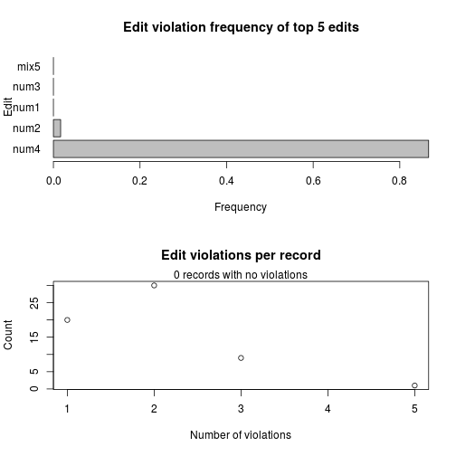
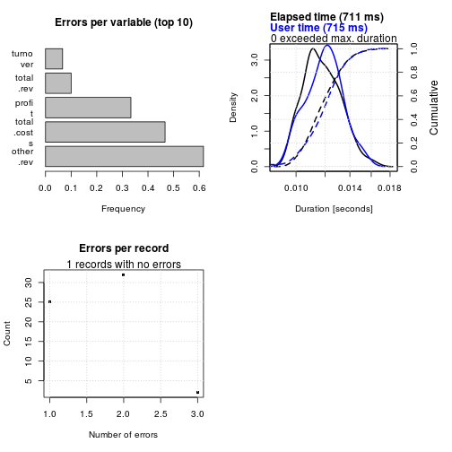
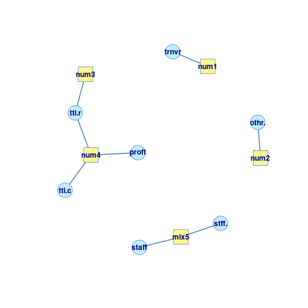
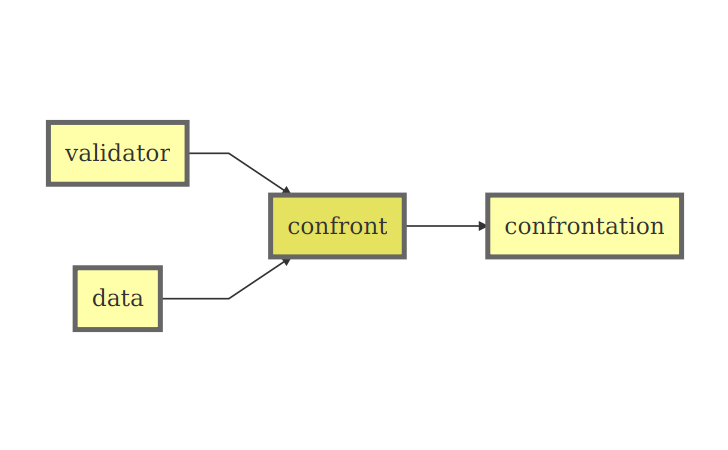

R-based validation software
========================================================
author: Mark van der Loo
date: 07/07/2015


Short overview
========================================================

- ```editrules``` (on [CRAN](http://cran.r-project.org/))
- ```validate``` (only on [github](https://github.com/data-cleaning/validate))

to try:
```
install.packages('editrules')
```
or (first install the [drat](http://cran.r-project.org/web/packages/drat/index.html) package and [rtools](http://cran.r-project.org/bin/windows/Rtools/))
```
drat::addRepo("markvanderloo")
install.packages("validate")
```

R package editrules
========================================================

- In-record validation rules:
    - linear equalities $$profit + cost = revenue$$
    - linear ineqeualities $$profit < 0.6*revenue$$
    - conditional: if male, then not pregnant
    - mixed: if people employed, then salary payed
- Check data against rules
- Error localization
- Detection of inconsistencies
- (rudamentary) redundancy detection
    - but complete detection is upcoming


R package editrules: detecting errors
========================================================


```r
library(editrules)
edits <- editfile("myedits.txt")
retailers <- read.csv2("retailers.csv")
ve <- violatedEdits(edits,retailers)
plot(ve)
```

 

R package editrules: localizing errors
========================================================
Using mixed integer programming, based on the principle of minimal change.


```r
el <- localizeErrors(edits, retailers, method="mip")
plot(el)
```

 

R package editrules: some analyses
========================================================


```r
plot(edits)
```

 

R package editrules: some analyses
========================================================

```r
summary(edits)
```

```
Summary of  editset 
     count
block edits num.edits mix.edits variables
    1     1         1         0         1
    2     1         1         0         1
    3     2         2         0         3
    4     1         0         1         2
```


R package validate
========================================================

- One tool, doing one thing, really well.
- Less features, but more rule types
- More programmability
    - templates (variable groups)
    - transient variables
    - file inclusion
- Build other features on top:
    - error localization
    - rule management
    - visualisation and network analyses


The main design
========================================================





Validate: workflow
========================================================


```r
library(validate)
v <- validator(.files="myedits2.txt")
v
```

```
Object of class 'validator' with 7 elements
V1: `:=`(G, { turnover other.rev total.rev })
V2: G > 0
V3: if (staff > 0) staff.costs > 0
V4: total.rev + total.costs == profit
V5: `:=`(ratio, profit/total.rev)
V6: ratio < 0.6
V7: turnover < 5 * median(turnover, na.rm = TRUE)
```

Validate: confront data with rules
========================================================


```r
cf <- confront(v,retailers)
summary(cf)
```

```
  rule items passes fails nNA error warning
1   V2    60     58    58   2 FALSE   FALSE
2   V3    60     50    50  10 FALSE   FALSE
3   V4    60      1     1   7 FALSE   FALSE
4   V6    60     49    49   5 FALSE   FALSE
5   V7    60     52    52   4 FALSE   FALSE
                                     expression
1        ({ turnover other.rev total.rev }) > 0
2                !(staff > 0) | staff.costs > 0
3             total.rev + total.costs == profit
4                      (profit/total.rev) < 0.6
5 turnover < 5 * median(turnover, na.rm = TRUE)
```


Validate: confront data with rules
========================================================


```r
 barplot(cf)
```

 


Functional dependencies
========================================================

If variables city and street are the same for two records,
then zipcode must be the same.

$$
city, street \to zipcode
$$

- Developed in the 1970s for DB specification
- FD's span a weak logic (no contradictions)
- FD's can be evaluated in $\mathcal{O}(n)$ time and memory. 


Functional dependencies in validate
========================================================


```r
vd <- validator(city + street ~ zipcode)
dat <- data.frame(
  street = c('kerkstraat','kerkstraat','kerkstraat','kerkstraat')
  , city = c('DH','DH','H','DH')
  , zipcode = c('2495','2496','8888','2495')
)
cf <- confront(vd,dat)
values(cf)
```

```
     V1
[1,]  1
[2,]  1
[3,]  3
[4,]  4
```

The end
========================================================


Questions?


