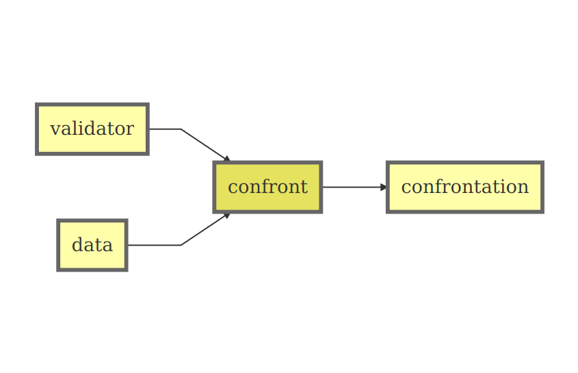

Infrastructure for data validation: the "validate" package
========================================================
author: Mark van der Loo and Edwin de Jonge
date: 02 September 2015


Materials
========================================================

- Package is on [CRAN](https://cran.r-project.org/web/packages/validate/index.html)
- github: data-cleaning/validate
- this talk: github.com/data-cleaning/validate/talks/ (look for `md` files)


```r
install.packages("validate")
```


Data validation
========================================================

Check assumptions about your data (_falsification_)

Examples:

- If a respondent declares to have income from _other activities_; fields
under _other activities_ must be filled.
- Yield per area (for a certain crop) must be between 40 and 60 metric tons
per hectare.
- A person below the age of 15 cannot take part in economic activity.
- The field _type of ownership_ (for buildings) may not be empty.
- The submitted _regional code_ must occur in the official code list.
- The sum of reported profits and costs must add up to the total revenue.


Examples (continued)
========================================================

- The persons in a married couple must have the same year of marriage.
- If a person is a child of a reference person, then the code of the
person's father must be the reference person's code.
- The number of employees must be equal to or greater than zero.
- Date of birth must be larger then 30 December 2012 (for a farm animal).
- If the number of employees is positive, the amount of salary payed must be positive.
- The current average price divided by last period's average price must lie
between 0.9 and 1.1.

Goal of the package
========================================================

Offer an _infrastructure_ that supports a broad range of data validation rules.

Currenlty:

- Define rules, command-line or from file
- Confront data with rules
- Analyze and visualize results
- Simple rule analyses


A word on "editrules"
========================================================

`editrules`' functionality is limited to in-record rules only
(specifically, rules that permit automated error localisation)

`validate` offers a much more generic framework for handling validation rules,
outsourcing some of `editrules` functionality to other packages.

`validate` aims to improve
- maintainability by focusing on a limited set of tasks
- extensibility by adopting an OO framework based on R5+S4


Basic idea
=========================================================




Most simple command-line use
==========================================================


```r
library(validate)
cf <- check_that(women
      , height>0
      , height/weight < 0.5
      )
summary(cf)
```
or, using the pipe operator


```r
library(magrittr)
women %>% 
  check_that(height > 0, height/weight < 0.5) %>% 
  summary()
```


Example data
==========================================================


```r
library(validate)
data(retailers)
head(retailers)[3:6]
```

```
  staff turnover other.rev total.rev
1    75       NA        NA      1130
2     9     1607        NA      1607
3    NA     6886       -33      6919
4    NA     3861        13      3874
5    NA       NA        37      5602
6     1       25        NA        25
```


Storing rules: validator objects
==========================================================


```r
v <- validator(
  staff >= 0
  , if (staff > 0 ) staff.costs > 0
  , staff.costs < total.costs
  , turnover + other.rev == total.rev
  , turnover + other.rev == total.rev
)
cf <- confront(retailers,v)
summary(cf)
barplot(cf,main="Retailers")
```


Observe
==========================================================

Workflow:

1. Define rules
2. Confront with data
3. Analyze resuls

Technical:
- Expressions have been processed
- Errors and warnings will be caught (switchable)
- Rules have some metadata (names)


What rules are allowed?
==========================================================

Informally:

_Any R-statement resulting in a `logical`, i.e. `TRUE`, `FALSE`, `NA`_

- Dimension structure of output may differ


```r
cf <- check_that(women
  , height > 0               # per record
  , cov(height,weight) > 0.9   # one value
)
summary(cf)
```
- nr of items checked reflects output dimension


Syntax: type-checks
==========================================================
Any `is.*` function is allowed, as is the set membership operator

```r
v <- validator(
  is.numeric(age)
  , is.character(city)
  , gender %in% c('male','female')
)
```


Syntax: cross-dataset rules
==========================================================
Use the `$` operator to reference other datasets

```r
v <- validator(height < women2$height)
```

Pass them in a `list` or `environment`

```r
confront(women, v, ref=list(women2 = 2*women))
```

Syntax: functional dependencies
==========================================================

Notation (by [Armstrong](https://en.wikipedia.org/wiki/Armstrong%27s_axioms), 1974)

$$
X,Y \to Z
$$

_If two records have the same value for $X$ and $Y$, they must have the same value for $Z$._

```
v <- validator(city + street ~ zipcode)
```

NB: like in `duplicated`, outcomes depend on record order.


Syntactic sugar: group definition
==========================================================
```
G := var_group(x,y,z)
G > 0
```
is equivalent to
```
x > 0
y > 0
z > 0
```

Syntactic sugar: macros
==========================================================

Example: Hiridoglou-Berthelot outlier check
```
r := height/weight
m := median(r)
pmax(r/m, m/r)-1 < 0.05
```
is translated to
```
pmax((height/weight)/(median((height/weight)))
, (median((height/weight)))/(height/weight)) - 1 < 0.05
```

- NB. the `:=` operator is not mapped in R.


Syntactic sugar: functions
==========================================================
- Any function in namespaces you can reach can be used.


```r
library(stringdist)

# approximate matching rule
v <- validator(
  ain(gender, c('male','female'), maxDist=2)
)
```
- Better support for stating dependencies and in-syntax definition will be supported in the future.


Rule metadata
==========================================================


```r
v <- validator(
  ratio = height/weight < 0.5
  , weight>0)

v[[1]]
```

```

Object of class rule.
 expr       : height/weight < 0.5 
 name       : ratio 
 label      :  
 description:  
 origin     : command-line 
 created    : 2015-09-02 11:55:29
```

Metadata from file: yaml format
==========================================================

```
# content of ex-1.yaml
rules:
- 
  expr: height/ weight < 0.5
  name: ratio
  label: hw-ratio test
  description: > 
    According to research the ratio between 
    height and weight
    should be less than 0.5.
- 
  expr: weight > 0
```


```r
v <- validator(.file="ex-1.yaml")
export_yaml(v,file="myfile.yaml")
```


Retrieve or set metadata for "validator" objects
==========================================================

General: (get)
- `length`: # of rules
- `summary`: blocks, properties
- `variables` : variables occurring in rules

Per rule: (get or set)
- `names`, `labels`, `description`
- `origin`, `created`
- subsetting with `[]` or `[[]]`


Free-format files 
==========================================================

```
# content of ex-2.txt
weight > 0

# comments here
mean(height)/mean(weight) < 0.5
```

Free-format mixed with yaml parts
==========================================================
```
rules:
-
  expr: weight > 0
  name: weight positivity
---
# free format from here

mean(height)/mean(weight) < 0.5

cov(weight,height) > 0.9

---
# more structured rules here

```

Programmability: include other files
==========================================================

- based on depth-first topological sort

```
---
include:
  - general_rules.yaml
  - more_rules.yaml
---
# specific rules here
```


Programmability: set options
==========================================================
```
options:
  raise : all
  lin.eq.eps : 0
include:
  - general_rules.yaml
---
# specific rules here
```


.plan
========================================================

In `validate`
- Indicators (currenlty in beta)

In revese dependencies:
- Support for push to databases
- Advanced rule analyses 
- Advanced visualization (`validate.viz`)
- Error localization (`validate.errloc`)
- Data cleaning algorithms (`validate.adjust`,...)
- GUI for rule definition
- ...


